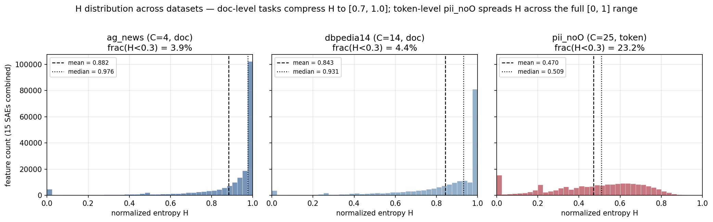
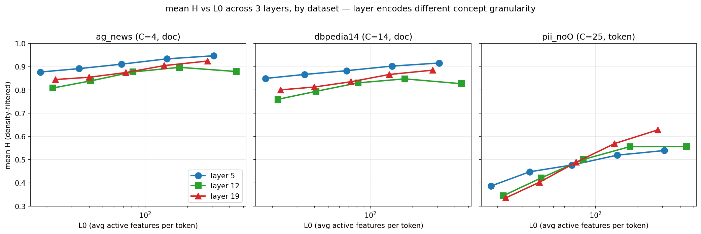
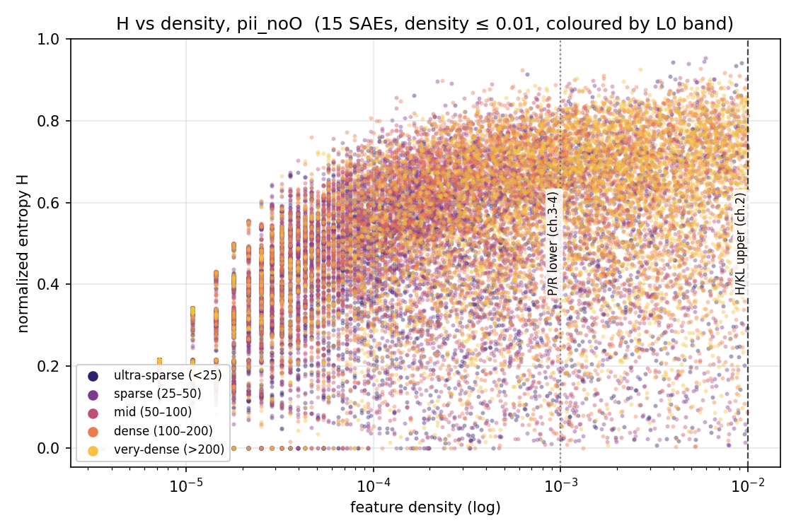
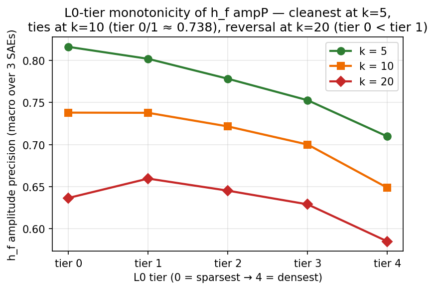

# SAE 特征单义性的信息论评估框架

本文档总结我们提出的基于香农熵 H 与 KL 散度的 SAE 特征单义性评估方法、相关实验结果及其有效性证明。

---

## 1. 基于信息论的单义性度量 H 与 KL

### 1.1 动机

评估一个 SAE 特征是否“单义”（monosemantic），核心问题是：**该特征的激活是否主要集中于单一或极少数语义概念？** 在本文中，这些“语义概念”由数据集标签所对应的类别近似表示。比如，一个只在“电子邮件地址”类 token 上稳定激活的特征，可以认为是高度单义的；而一个同时在“电子邮件”、“人名”、“城市”和“非实体 token”上都有激活的特征，则更接近多义特征。

严格地说，本文直接测量的并不是"单义性"本身，而是**激活分布在预定义类划分上的集中度**，下文称为**类对齐度 / 类别选择性**。类对齐是单义性的**必要但不充分**条件：真正单义的特征应在有意义的类划分上保持对齐，而只对某一划分对齐的特征仍可能在类内混合子概念。本文将类对齐度作为单义性的**操作化代理**，并通过第 3、4 节的 P/R 反向验证检验这一代理。

据此，本文把特征在各类别上的激活分配看作一个概率分布，并用其集中程度度量类对齐度。只看“激活最多的是哪一类”并不够；关键在于**整个类别分布是否足够集中**。

香农熵正好可以刻画这种集中程度。若一个特征的激活完全集中于单一类别，则熵取最小值 0；若其激活在全部类别上均匀分布，则熵取最大值 $\log_2 C$。因此，熵可以自然地形式化这样一个直觉：**激活越集中，特征越单义；激活越分散，特征越多义。**在此基础上，本文再引入 KL 散度作为**辅助指标**，用于处理类别先验严重不均衡时仅靠熵可能产生的偏差。

### 1.2 符号与记号

为了把“一个特征主要响应哪些类别”写成可计算的量，先定义如下记号：

- $F$：SAE 特征总数；
- $C$：类别总数；
- $N$：参与统计的有效样本总数；
- $a_f(t) \ge 0$：特征 $f$ 在样本 $t$ 上的激活值；
- $y(t) \in \{0, 1, \dots, C-1\} \cup \{-1\}$：样本 $t$ 的类别标签，$-1$ 表示该样本不参与统计。

基于这些记号，定义特征 $f$ 在类别 $c$ 上的**累积激活强度**为

$$
S_f(c) = \sum_{t:\, y(t) = c} a_f(t),
$$

即把特征 $f$ 在该类别全部样本上的激活值相加。进一步定义

$$
T_f = \sum_{c=0}^{C-1} S_f(c) = \sum_{t:\, y(t)\ge 0} a_f(t),
$$

表示特征 $f$ 在所有有标签样本上的总激活强度。

$S_f(c)$ 刻画了特征 $f$ 在类别 $c$ 上累积了多少激活强度，$T_f$ 则给出其总激活强度。后续所有指标都建立在这两个量之上。换言之，本文关注的不是某个特征在多少个样本上激活，而是它的**总激活强度如何在各类别之间分配**。

### 1.3 算法框架

有了 1.2 节定义的 $S_f(c)$ 和 $T_f$，下一步是把“特征的激活主要流向哪些类别”变成一个可比较的标量指标。基本思路是，先将激活强度归一化为类别分布，再用信息论量刻画该分布的集中程度，以及它是否只是跟随数据先验。

基于这一路径，本文构造两个特征级指标：**归一化香农熵 $H$** 作为主指标，用于衡量特征激活在类别上的集中程度；**KL 散度**作为辅助指标，用于识别类别不均衡场景下的虚假低熵现象。

第一步是把 1.2 节的累积激活量归一化为概率分布。定义在特征 $f$ 被激活的条件下，样本属于类别 $c$ 的条件概率为：

$$
P(c \mid f) = \frac{S_f(c)}{T_f}.
$$

$P(c \mid f)$ 满足概率分布的基本性质：$\sum_c P(c \mid f) = 1$，且 $P(c \mid f) \ge 0$。它描述的是**特征 $f$ 的全部激活中有多大比例落在类别 $c$ 上**。因此，$P(c \mid f)$ 将特征激活写成了一个定义在类别集合上的概率分布，后续便可以直接用信息论量刻画其集中程度。1.1 节的核心直觉是：特征的激活越集中在少数类别上，它就越单义。香农熵正好对应这一点。定义特征 $f$ 的归一化熵为：

$$
H(f) = \frac{-\sum_{c=0}^{C-1} P(c \mid f) \log_2 P(c \mid f)}{\log_2 C} \in [0, 1].
$$

其中约定 $0 \log 0 = 0$。分母 $\log_2 C$ 是 $C$ 类均匀分布时的最大熵，它把 $H$ 归一化到 $[0,1]$ 区间内，从而允许我们在类别数不同的数据集之间横向比较。当 $P(c \mid f)$ 完全集中于单一类别时，$H(f)=0$；当 $P(c \mid f)$ 在所有类别上均匀分布时，$H(f)=1$。因此，$H(f)$ 越小，特征在当前类划分上的**类对齐度**越高；按 1.1 节的代理假设，这也意味着该特征越接近单义。

$H$ 是本工作的主指标，因为它直接回答了我们最关心的问题：**这个特征的激活是否集中在少数类别上。** 它只依赖特征自身的类别分布，不引入外部先验。

$H$ 的问题也恰恰来自它的优点：它只看分布有多集中，而不问这个分布为什么集中、又集中在什么地方。在类别分布近似均衡的数据集上，这通常不是问题；但在**类别分布严重不均衡**时，就会出现系统性偏差。

考虑一个典型的实体标注场景：90% 的 token 都属于 “O”（非实体类），只有 10% 属于各类实体。如果某个特征把 99% 的激活都放在 “O” 类上，那么它的 $H$ 仍然会很低，看起来像一个“很单义”的特征。可实际上，它可能只是跟随了数据里最常见的背景类，而没有学到真正有区分力的概念。

这说明，$H$ 无法区分两种不同来源的“集中”：一种是**真正锁定某个概念**的集中，另一种是**仅仅跟随数据先验**的集中。后者会产生一种表面上很单义、实际上信息量很低的特征，本文将其称为**虚假低熵**。

要识别这种虚假低熵，就需要给 $P(c \mid f)$ 找一个参照物。最自然的参照不是均匀分布，而是**数据本身的类别先验**：

$$
Q(c) = \frac{N_c}{N}, \qquad N_c = \#\{t : y(t) = c\}.
$$

这里选择经验频次先验，而不是均匀先验 $Q(c)=1/C$。原因在于，真实数据本身往往是不均衡的。若把均匀分布当作基线，那么任何偏离均匀的特征都可能被误判为“高信息量”，其中也包括那些只是机械地跟随数据分布的平庸特征。相反，采用经验频次先验后，$\mathrm{KL}=0$ 恰好对应这样一种情况：**特征的类别分布与数据先验完全一致，因此它对类别没有额外选择性。**

在此基础上，定义特征 $f$ 相对于类别先验的 KL 散度为：

$$
\mathrm{KL}(f) = \sum_{c=0}^{C-1} P(c \mid f) \log_2 \frac{P(c \mid f)}{Q(c)}.
$$

回到上面的例子。若一个特征只是跟随 “O” 类背景分布，则其 $P(c \mid f)$ 与 $Q(c)$ 会非常接近，因此 $\mathrm{KL}(f) \approx 0$；若另一个低 $H$ 特征把激活集中在某个稀有实体类上，则其 $P(c \mid f)$ 与 $Q(c)$ 会明显不同，$\mathrm{KL}(f)$ 也会较高。前者虽然低熵，但并没有偏离背景分布；后者则更像是真正具有类别选择性的单义特征。

当类别分布严格均衡，即 $Q(c) = 1/C$ 时，有

$$
\mathrm{KL}(f) = \log_2 C \cdot (1 - H(f)).
$$

在这一情形下，$H$ 与 $\mathrm{KL}$ 携带相同的信息；当类别分布近似均衡时，两者也近似等价，因此 $H$ 单独即可胜任。相反，当类别分布严重不均衡时，两者会解耦：$H$ 仍度量分布的绝对集中程度，而 $\mathrm{KL}$ 则刻画其相对于数据先验的偏离，因此能够识别前述虚假低熵类型。综上，本文将 **$H$ 作为主指标**，用于量化特征激活在类别上的集中程度；将 **$\mathrm{KL}$ 作为辅助指标**，用于识别类别不均衡时的虚假低熵。至此，H/KL 框架的定义与方法定位已经明确；第 3、4 节将进一步把两者作为独立的特征排序信号进行 P/R 验证，以检验这种“主指标 + 辅助指标”的分工是否成立。

### 1.4 实现细节

本节讨论上述 H/KL 框架在本文中的具体实例化方式与实现口径。整体上，这些细节可分为三个层面：标签粒度的选择、统计口径的设定，以及具体的计算与筛选流程。

首先，在标签粒度上，H/KL 框架既可以定义在 document-level，也可以定义在 token-level，区别仅在于 $S_f(c)$ 的累加单位是文档还是 token。本工作采用 **token-level** 作为主要实例化方式。一个直接原因是，标签粒度决定指标的有效分辨率。在 ag_news（4 类）和 dbpedia14（14 类）这类 document-level 数据集上，单篇文档往往同时涉及多个概念，特征难以只对应单一文档类别，结果是 $H$ 的动态范围被压缩在较高区间，难以拉开明显的单义性差异。相比之下，token-level 标签将类别单位细化为 PII 实体类型，类别数也相应增加，因而更容易暴露出低 $H$、高选择性的特征。

采用 token-level 的另一个原因是，细粒度标签更接近本文关心的实体级语义单位，例如“电子邮件地址”或“人名姓”等类别。此外，token-level 设定更容易显露 SAE 特征的组合性：实验中同一类别往往需要多个子特征联合覆盖，而不是由单一特征独占。这也说明后续 P/R 验证需要采用 top-k 特征联合评估，而不能仅依赖单特征视角。

对 `pii-masking-300k` 而言，本文主结果采用的是**排除非实体类 `O` 的 noO 变体**。这样做的目的不是改变 H/KL 的定义，而是避免主导背景类在主实验中压缩指标的可读性；其必要性与影响在第 2.5 节中进一步展示。

其次，在统计口径上，本文采用**激活值加权**而不是激活计数。也就是说，$S_f(c)$ 和 $T_f$ 累计的是激活强度之和，而非“激活发生的次数”。这样做的原因是，在 JumpReLU SAE 中，激活幅度通常反映了特征与输入的匹配程度：强激活更能代表该特征真正编码的语义内容。若改用激活计数，将所有非零激活等权处理，则弱激活也会获得与强激活相同的权重，从而稀释语义信号。

与此相关的另一个实现假设是，特征是否激活采用 `>0` 判定。这一判定依赖 SAE 激活的严格稀疏性；对本文使用的 `gemma-scope` JumpReLU SAE，额外检查表明非零激活与零值之间存在清晰间隔，因此 `>0` 作为激活阈值是安全的。

最后，在具体计算流程中，所有指标仅对 alive 特征计算。若某一特征在全部有标签样本上的累积激活强度 $T_f$ 低于给定阈值（本工作中为 $10^{-5}$），则将其视为死特征并从统计中排除，以避免分母过小带来的数值不稳定。被排除的特征在输出中记为无效值，不参与后续聚合。需与之区分的是 density 过滤：它是在 alive 特征基础上的进一步筛选，属于实验设置而非指标定义本身。本工作按不同阶段的关注点施加**单侧**过滤：**H/KL 聚合统计（第 2 章）只施加密度上界** $\le 10^{-2}$，用于把句法/通用高频特征排除在聚合均值之外——这类特征若不剔除，会系统性抬高聚合 $\text{mean }H$ 并压低 $\text{frac}(H<\cdot)$ 等尾部统计量；**P/R 反向验证（第 3、4 章）则只施加密度下界** $\ge 10^{-3}$，用于剔除在评估样本上几乎不激活、$P(c\mid f)$ 估计方差过大的噪声特征。两个阶段不共用同一套 band-pass，因为“聚合均值被拉偏”与“top-k 候选池混入噪声”是两种不同的干扰，关注点分别落在过滤的一端。

从实现上看，计算只需对每个类别累计特征激活强度，得到 $S_f(c)$ 与 $T_f$，再据此归一化得到 $P(c \mid f)$，并进一步计算 $H$、类别先验 $Q(c)$ 以及 $\mathrm{KL}$。其中，对 $Q(c)$ 需要做下界截断，以避免零频类别导致对数项数值不稳定。整个过程可以通过流式累加完成，时间复杂度为 $O(N \cdot F)$，无需额外训练任何模型。

---

## 2. H/KL 结果与分析

本章展示 H/KL 指标在不同数据集、不同层和不同稀疏度下的表现。实验基于 15 个 `gemma-scope-2b-pt-res` SAE，它们由 3 个层位（layer 5 / 12 / 19）与 5 个稀疏度档（从 ultra-sparse 到 very-dense）组合而成，共构成 $3 \times 5$ 个配置。结果覆盖 3 个数据集：ag_news（4 类，document-level）、dbpedia14（14 类，document-level）和 pii-masking-300k 的 pii_noO 变体（25 类，token-level）。更完整的模型与 SAE 配置见第 7 节。

### 2.1 标签粒度对 H/KL 动态范围的影响

H 的取值落在 $[0, 1]$，但其分布能否充分展开，取决于数据集标签的粒度。为此，我们在 ag_news（4 类，document-level）、dbpedia14（14 类，document-level）和 pii-masking-300k（25 类，token-level）三个数据集上运行了同一组 15 个 SAE，比较不同标签粒度下 H/KL 分布是否能够被有效拉开，聚合结果见表 2.1。

**表 2.1 三数据集聚合统计（15 SAE 平均，已剔除 density > 0.01 的高频特征）**

|   数据集    | 类别数 | 标签粒度  | H 均值 | H 中位数 | KL 均值 | H<0.3 占比 | H<0.5 占比 |
| :---------: | :----: | :-------: | :----: | :------: | :-----: | :---------: | :---------: |
|   ag_news   |   4    | document  | 0.8843 |  0.9748  | 0.2313  |    3.7%     |    7.3%     |
|  dbpedia14  |   14   | document  | 0.8451 |  0.9338  | 0.5908  |    4.2%     |    8.4%     |
| **pii_noO** | **25** | **token** | **0.4782** | **0.4996** | **2.4167** |  **23.5%**  |  **49.0%**  |

表 2.1 总结了三数据集上 H/KL 分布的中心位置与阈值占比；图 2.1 则进一步展示了 H 的完整分布形状。图中可以看到，两个 document-level 面板的直方图质量都高度集中于 $H \to 1$ 一端，呈现明显的右端堆积；切换到 token-level 的 pii_noO 后，分布明显展开，并在低 H 区域形成清晰的左尾。



**图 2.1** 三数据集上归一化香农熵 $H$ 的分布对比（15 SAE 汇总，已剔除 density > 0.01 的高频特征）。虚线为均值，点线为中位数。Doc-level 任务（ag_news, dbpedia14）的 $H$ 分布显著右偏，并压缩在高 H 区间；token-level 的 pii_noO 上，$H$ 分布则明显展开，左侧低 H 区域出现更多质量。

从表 2.1 与图 2.1 可以先读出一个总体对比：两个 document-level 数据集的 H 中位数都大于 0.93，超过一半的 alive 特征在这两个数据集上的类别分布都**接近均匀**，而“明显单义”（H<0.3）的特征占比只有 3.7% / 4.2%。这意味着在 document-level 设定下，**H 的动态范围被压缩在 [0.7, 1.0] 的狭窄区间里**，大多数特征在指标上都表现为较高的多义性。

切到 token-level 的 pii_noO 之后，情况则明显不同：H 均值从 0.88/0.85 降到 0.48，H 中位数降到 0.50，“明显单义”特征的占比从约 4% 提升到 **23.5%**，而 H<0.5 的特征占比接近一半。KL 的方向与 H 对称变化：KL 均值从 ag_news 的 0.23 上升到 pii_noO 的 2.42，约放大 10 倍。换言之，**H 和 KL 的动态范围只有在细粒度 token 级任务上才会明显展开**。

这些差异首先说明，测量工具的有效性取决于它是否与被测对象的结构粒度相匹配。document-level 任务只有 4–14 个粗类别，一篇新闻往往同时涉及多个主题，单个特征天然更可能落在多个文档类上；把标签细化到 token 级的 25 类 PII 实体之后，“一个特征只为一类实体激活”才在统计上更接近可观察的情形，单义性信号也更容易被 H 捕捉到。因而，这里的跨数据集比较主要反映**标签粒度对指标动态范围的影响**，而不应直接理解为“同一组 SAE 在某个数据集上表现得绝对更好”。

基于这一点，后续分析将以 **pii_noO** 作为主分析对象，因为只有在该设定下 H/KL 的动态范围被充分拉开；ag_news 和 dbpedia14 则作为**对照对象**，用来判断某些现象究竟来自 SAE 本身，还是来自标签粒度。

### 2.2 不同稀疏度 SAE 的特征单义性

在 2.1 节确定 pii_noO 为主分析设定之后，本小节考察**不同稀疏度的 SAE 会呈现怎样的特征单义性分布**。为先识别稀疏度的主效应，下面按平均 L0 档位对 15 个 SAE 做边际聚合；与 layer 相关的结构留到 2.3 节讨论。

**表 2.2 按平均 L0 档位聚合（每档 3 层特征池汇总，pii_noO，已剔除 density > 0.01 的高频特征）**

|     平均 L0 档位      | H 均值 | KL 均值 | frac(H<0.1) | frac(H<0.3) | frac(H<0.5) |
| :-------------------: | :----: | :-----: | :---------: | :---------: | :---------: |
| ultra-sparse (L0<25)  | 0.352  |  3.134  |    20.1%    |    40.1%    |    69.0%    |
|    sparse (25–50)     | 0.419  |  2.798  |    12.8%    |    29.4%    |    57.7%    |
|     mid (50–100)      | 0.481  |  2.448  |     7.1%    |    20.6%    |    47.0%    |
|    dense (100–200)    | 0.537  |  2.095  |     4.0%    |    14.3%    |    37.1%    |
|   very-dense (>200)   | 0.556  |  1.890  |     3.4%    |    12.6%    |    33.4%    |

从表 2.2 可以先得到本节最核心的结论：随着 SAE 从 ultra-sparse 走向 very-dense，H 均值持续上升、KL 均值持续下降，说明**SAE 越稠密，特征整体上越趋向多义；SAE 越稀疏，特征整体上越趋向单义**。这一趋势在 5 个 L0 档位上都保持单调。

比起均值本身，更值得关注的是低 H 尾部的变化。随着 L0 增大，H<0.1、H<0.3 和 H<0.5 三个阈值下的特征占比都系统性下降，其中最严格的 H<0.1 从 20.1% 降到 3.4%。这说明密集 SAE 优先损失的是最单义的那部分特征，而不只是把整条分布整体向右平移。

进一步沿 L0 轴看，这一单调关系并不是均速推进的，而是表现出明显的**饱和**。从 ultra-sparse 到 dense，H 均值和各个低 H 阈值占比都变化显著；但从 dense 到 very-dense，L0 继续增大时，这些统计量的变化已经明显减弱。换言之，**稀疏度对单义性的主要影响集中在较低到中等 L0 区间，之后继续增大 L0 的边际作用会变小**。

若进一步看代表性 SAE 的绝对数量，低 H 尾部的实际体量也会更加清楚：在 pii_noO 上，3 个 ultra-sparse SAE（L0 ≈ 18–23）各自独立贡献 **2100–2650 个 H<0.1 特征与 4300–5300 个 H<0.3 特征**；而 very-dense 端最极端的 (layer 19, L0=279) 只剩 41 个 H<0.1 特征，相差约 65 倍。也就是说，稀疏档 SAE 单个就有千级的可用单义候选——这一量级足以支撑第 3–4 章对低 H 特征的 P/R 验证。

这一结果与 SAE 训练中常见的“稀疏—容量权衡”相一致：低 L0 约束了每个 token 可同时调用的特征数，使单个特征更倾向于承担较窄、较纯的语义方向；高 L0 则允许更多特征共同参与重构，从而更容易形成宽而混合的激活模式。需要强调的是，这里给出的仍是**与结果相容的机制解释**；实验直接支持的主要是：L0 与 H/KL 呈稳定单调关系，而且这种影响首先体现在低 H 尾部。不过，这些结论仍然是对不同 layer 求平均后的边际结果；要判断不同层级是否呈现相同模式，还需要进一步考察 layer 结构。

### 2.3 不同层级下的特征单义性

2.2 节已经说明，L0 决定了单义性的总体变化方向。本小节进一步考察：**在这一总体趋势之上，不同 layer 是否还会改变特征单义性的结构。** 如果只看 pii_noO 上按 layer 聚合的边际均值，layer 5 / 12 / 19 的 H 均值都落在 0.474–0.485 之间，差别不到 3%，似乎说明 layer 作用很弱。但这只是边际平均后的结果；一旦把 3 个数据集、3 个 layer 与 5 个 L0 一起展开，layer 与 L0、任务之间的交互结构就会显现出来：



**图 2.3** 三数据集上 mean H 随 L0 的变化，按 layer 分色（layer 5 蓝、layer 12 绿、layer 19 红）。三面板 y 轴统一在 0.3–1.0 以便横向比较，从左到右依次为 ag_news / dbpedia14 / pii_noO。

图中的模式可以自然分成 document-level 与 token-level 两类。

**(a) document-level（ag_news, dbpedia14）：layer 12 稳定占优。** 在两个 document-level 面板中，layer 5 始终对应最高的 H，layer 12 基本始终最低，layer 19 稳定居中偏低。更重要的是，这一排序从低 L0 到高 L0 基本不变，因此这里的 layer 效应可以概括为：**排序稳定、方向一致、基本不受 L0 调制**。

一种与此相容的解释是：新闻主题或百科类别这类概念处于中等抽象层级，在中层残差流上更容易找到与其对应的方向；浅层偏字符/词形、晚层偏输出导向的表征，都与“主题类”概念单位不对齐。这仍属于**与结果相容的语义解释**，而非由本节实验单独确证的机制结论。

**(b) token-level（pii_noO）：layer 效应随 L0 翻转。** 同样的布局换到 pii_noO 面板上，图景则完全不同：在较低 L0 档上，layer 19 的 H 最低、layer 5 最高；随着 L0 增大，layer 5 逐渐反超成为 H 最低，而高 L0 档上则由 layer 5 最优、layer 19 最差。也就是说，**pii_noO 上并不是没有 layer 效应，而是 layer 效应本身会随 L0 改变方向。** 这也解释了为什么只看边际均值时三层差异很小：不同 L0 档位中的 layer 排序在聚合时互相抵消了。

进一步看可以发现，这种交互的强度也不是均匀的：在翻转点附近，三层曲线彼此更接近；在低 L0 和高 L0 两端，层间差距则更明显。更关键的是，单层内部随 L0 变化带来的 H 波动，大于同一 L0 档位上不同层之间的差距。因此，对 pii_noO 而言，**L0 仍然是主导变量，layer 更多是在此基础上做条件调制**。作为稳健性校验，KL 在各个 L0 档位上给出的最佳层排序与 H 基本一致，这说明这一翻转结构并非 H 单一指标的偶然产物。

一种可能的解释是：token-level PII 线索本身横跨多个层次（字符形态、边界/上下文、句法），不同层的相对优势因此可能随 L0 调制而翻转。数据直接支持的只是“layer 效应依赖于 L0 档位”这一交互现象；至于各层究竟对应何种语义线索，仍需特征级证据才能判定。

综合 (a) 和 (b) 两类模式可以看到，“哪一层更优”并不是一个脱离任务独立存在的问题，而是取决于**标签所对应概念单位与残差流层次之间的匹配关系**。在当前实验中，document-level 主题任务表现为相对稳定的中层优势；token-level PII 则表现出明显的 layer × L0 交互。与此同时，图 2.3 还揭示了一个更高层的事实：pii_noO 上所有格子的 H 都低于两个 document-level 面板中的任一格子。这说明在当前实验范围内，**标签粒度对 H 的影响强于 layer 与 L0 的联合作用**。

### 2.4 H 与 density 的联合分布

2.2 与 2.3 节主要是在 SAE 层面比较不同 L0 档位与不同 layer 的平均表现。这一视角能够回答“哪类 SAE 整体上更单义”，但还不足以说明单义特征在特征空间中呈现出怎样的分布结构。为此，本小节进一步下沉到**特征级别**，以 pii_noO 为例考察 H 与 density 的联合分布：



**图 2.4** pii_noO 上 15 个 SAE 的特征级 $H$–density 联合分布（每档 L0 抽样 5000 点）。颜色按 L0 档位从稀疏（深紫）到稠密（橙黄）排序；黑虚线为本章 H/KL 的 $10^{-2}$ 上界，灰点线为后续验证阶段采用的 $10^{-3}$ 下界（本章不施加）。散点在低 density 区呈上下两层的 bi-modal 结构，在高 density 区向 $H \to 1$ 带收敛；图左下角 $\lesssim 10^{-4}$ 的 H≈0 条带为小样本伪影。

散点揭示出一个清晰的**两段结构**。在低 density 区间（约 $10^{-4}$ 到 $10^{-3}$），H 的分布明显分成上下两层：上层贴近 1 的是多义特征，下层贴近 0 的是高度单义特征，二者并存，且低 H 层里以深色（稀疏档）为主、暖色（稠密档）为辅，这与 2.2 节“稀疏 SAE 更单义”的趋势一致。相对地，在高 density 区间（约 $10^{-3}$ 到 $10^{-2}$），H 迅速向 0.7–1.0 区间收敛，低 H 特征几乎消失。也就是说，在当前结果中，**一旦特征激活得足够频繁，它通常也就不再单义**。

同时还需要注意图左下角 $\lesssim 10^{-4}$ 的 H≈0 条带。该区特征在评估样本上往往只有 1–2 次激活，$P(c\mid f)$ 因小样本几乎必然退化到单类，因此这里的 H≈0 更可能是统计伪影，而不是真实单义性。这也是后续验证阶段在 $10^{-3}$ 处设置 density 下界的直接原因。

这一联合结构为本章 H/KL 聚合统计**施加 density 上界**提供了直接经验依据：当 density 接近 $10^{-2}$ 时，图中几乎只剩 $H \to 1$ 的多义特征。如果不把这类高频多义特征排除，就会系统性抬高 $\text{mean }H$ 并压低 $\text{frac}(H<\cdot)$ 等尾部统计量，从而淹没稀疏档 SAE 本应呈现的低 H 信号。相对而言，是否在本章再施加一个 density 下界，对分布级聚合的影响有限；但在按 top-k 挑选候选特征时，下界会直接影响结果，因此这一步留到后续验证阶段单独处理。综合来看，**单义特征通常同时表现出较低频率与较强类别定向性**，这也构成了后续将 $H$ 与 density 结合做候选筛选的经验基础。

### 2.5 虚假低熵陷阱

在前面的主结果分析之外，还需要单独讨论一个会直接影响指标解读的方法论陷阱：如果在评估时**不排除** `"O"`（非实体）这一类，而直接将 `pii_withO` 的结果当作单义性证据，就会得到一组看起来十分显著、但实际上具有误导性的数字：

**表 2.5 pii_withO 与 pii_noO：虚假低熵现象对比**

|   数据集    | 是否包含 O 类 | 类别数 | H 均值 | H 中位数 | KL 均值 | H<0.3 占比 | H<0.5 占比 |
| :---------: | :-----------: | :----: | :----: | :------: | :-----: | :---------: | :---------: |
|  pii_noO    |      否       |   25   | 0.4782 |  0.4996  | 2.4167  |    0.235    |    0.490    |
| pii_withO   |      是       |   26   | 0.1962 |  0.1087  | 0.8205  |    0.743    |    0.892    |

从表 2.5 可以看到，`pii_withO` 上的 H 均值从 0.48 降到 0.20，H 中位数从 0.50 降到 0.11，`H<0.3` 的特征占比更是从 24% 上升到 74%。如果只看 H，几乎会得出“这组 SAE 有四分之三的特征是单义的”这样的结论；但这恰恰对应了一个典型的虚假低熵现象。

陷阱的来源正是第 1 节已经指出的问题：**当 `"O"` 占据绝对多数 token（80%+）时，一个只是跟随背景分布激活的平庸特征，其 $P(c \mid f)$ 也会集中到 `"O"` 这一类上，从而获得很低的 H。** 但 H 度量的只是“分布有多集中”，并不能区分“集中在有意义的实体类”与“集中在平庸的背景类”。

**KL 在这里提供了必要的校正信号。** `pii_withO` 上的 KL 均值从 2.42 降到 0.82，不到 `pii_noO` 的三分之一。这说明那些在 `withO` 设定下看起来“低 H”的特征，其类别分布与数据先验 $Q$ 非常接近，偏离量很小，因此更像是在跟随背景分布，而不是在表达真正有区分力的概念。换言之，在这种类别先验高度不均衡的设定下，**低 H 需要与 KL 结合起来解释**。

这也正是第 1 节所说“H 为主、KL 为辅”中“辅”的含义：当类别先验严重不均衡时，KL 为 H 提供了必要的交叉验证。基于这一点，本文在主实验中采用 `pii_noO`，即直接把 `"O"` 类排除在评估之外，让 H 在没有主导背景类的场景中承担主判断，并将 KL 保留为必要的背景校正信号。

### 2.6 本章小结

综合 2.1–2.5 节的结果，本章的实证分析可以收束为两点：一是 **H/KL 指标在细粒度 token 级场景下能够有效拉开单义性结构**；二是 **这一结构主要由标签粒度、SAE 稀疏度以及 layer × L0 交互共同塑造**。下面将本章的主要结论与局限性分别概括如下。

主要结论：

- **在细粒度 token 级场景中，H/KL 的动态范围能够被有效拉开。** 在 `pii_noO`（25 类）上，H 均值约为 0.48，`H<0.3` 的特征占比达到 23.5%，说明这组 SAE 中确实存在数量可观的高选择性特征。
- **标签粒度是决定 H/KL 是否具有判别力的首要因素。** 与两个 document-level 数据集相比，`pii_noO` 的 H/KL 分布明显展开，这说明标签粒度本身决定了指标动态范围能否被有效拉开。
- **SAE 稀疏度是影响单义性的主导超参数。** 越稀疏越单义；这一趋势不仅体现在 H/KL 均值上，也体现在低 H 尾部特征的占比和绝对数量上。
- **layer 的作用取决于标签概念单位与残差流层次之间的匹配关系。** 在 document-level 主题任务上，layer 12 持续占优；在 token-level PII 任务上，layer 效应则受到 L0 调制，出现明显的交互翻转。
- **在特征级别，H 与 density 呈现稳定的联合结构。** 高频特征通常更趋向多义，而低频区域同时包含单义与多义两类特征；因此，单义特征在当前结果中通常同时表现出较低频率与较强类别定向性。

局限性：

- **document-level 任务上的分辨率仍然有限。** 在 `ag_news` 和 `dbpedia14` 上，H 分布整体压缩在高值区间，因此这些结果更适合用来判断指标动态范围是否被打开，而不宜直接与 `pii_noO` 做绝对优劣比较。
- **layer × L0 的交互结构目前仍缺乏机制层面的直接证据。** 例如 `pii_noO` 上高 L0 条件下浅层反超深层的现象，目前仍主要停留在定性解释层面。
- **低 density 区域存在小样本伪影。** 因此，本章只对 H/KL 聚合统计施加 density 上界，而将更严格的 density 下界留到后续验证阶段处理。
- **`withO` 设定会诱发典型的虚假低熵。** 在主导背景类存在时，低 H 不能直接视为单义性证据，必须结合 KL 一起解释；这也是本文主实验采用 `pii_noO` 的直接原因。
- **`H<0.3`、`H<0.5` 等阈值统计主要用于描述性展示。** 更稳健的结论仍来自分布整体的移动方向、L0 的单调关系以及 layer/L0 的相对排序。

---

## 3. H/KL 的反向交叉验证

### 3.1 动机

第 1、2 章使用 $H(P(c \mid f))$ 和 $\mathrm{KL}(P(c \mid f) \parallel Q(c))$ 描述特征的类分布有多集中、以及它相对于数据先验有多偏离。这两类指标都沿着同一个方向计算：**Feature → Concept**。它们回答的是“给定一次特征激活，这次激活更可能来自哪一类”。因此，第 3 章引入一个反向的外部验证：**Concept → Feature**。给定某一类的全部 token，问题不再是“这些激活属于哪一类”，而是“为该类选出的 top-k 特征能够覆盖其中多少实例”。

这正对应于 Recall，而且其定义不再直接复用 $P(c \mid f)$ 的激活加权分子分母。Recall 是检验 H/KL 是否真正有效的核心证据：如果低 H / 高 KL 挑出的特征确实更单义，它们就应当在对应类的实例上稳定激活，并取得更高的覆盖率。

Precision 与 Recall 在这里互补。Recall 检查覆盖率，幅度 Precision 衡量这些特征在激活时是否真正集中于目标类。理想的高类对齐特征应当同时具有较高 Recall 与较高幅度 Precision；相反，那些只在少量样本上偶然命中某个类、类对齐度虚高的特征，通常会首先在 Recall 上暴露出来。

第 4 章将据此考察两条对照：Recall 相对 random baseline 的增益回答“H/KL 排序本身是否有效”，而幅度 Precision 相对 `density` / `mi` 的优势则回答“这种有效性是否只是顺带挑到了高频特征”。频率 Precision 保留为保守下界，用于对照幅度加权所揭示的“强 TP、弱 FP”结构。

### 3.2 P/R 评估框架

设 $\mathcal{F}$ 为参与评估的特征集合，$\mathcal{C}$ 为类空间。对每个特征 $f \in \mathcal{F}$，我们先用第 1 节已有的 $P(c \mid f)$ 把它唯一地指派给一个主类：

$$
c_f \;=\; \arg\max_{c \in \mathcal{C}} P(c \mid f)
\;=\; \arg\max_{c} \frac{\sum_{t:\, y_t = c} a_f(t)}{\sum_{t} a_f(t)}
$$

其中 $a_f(t)$ 是特征 $f$ 在 token $t$ 上的激活值，$y_t$ 是该 token 的类标签。分子分母都采用激活加权，与第 1 节 $P(c \mid f)$ 的定义完全一致。随后，对每个评估类 $c$ 和每个 ranking group $g$（分数函数 $s_g$），从主类为 $c$ 的候选特征集合中选前 $k$ 个：

$$
\mathcal{T}_{g,c,k} \;=\; \text{top-}k\bigl(\{f : c_f = c\},\; s_g\bigr)
$$

其中 $s_g$ 可以是 KL、H、density 等，具体排序组见 3.3 节。

据此，可定义 token 级的频率精度。把 $\mathcal{T}_{g,c,k}$ 中的 $k$ 个特征视为一个 OR-union 分类器：一个 token $t$ 被预测为类 $c$，当且仅当集合中至少有一个特征在 $t$ 上激活。记指示函数 $\mathbb{1}_{\text{hit}}(t) = \mathbb{1}[\exists f \in \mathcal{T}_{g,c,k}: a_f(t) > 0]$，并记 $N_c$ 为类 $c$ 的 token 总数，则：

$$
\text{TP}(c) = \sum_t \mathbb{1}_{\text{hit}}(t)\,\mathbb{1}[y_t = c],\quad
\text{FP}(c) = \sum_t \mathbb{1}_{\text{hit}}(t)\,\mathbb{1}[y_t \ne c],\quad
\text{FN}(c) = N_c - \text{TP}(c)
$$

$$
P_{\text{tok}}(g,c,k) = \frac{\text{TP}(c)}{\text{TP}(c)+\text{FP}(c)},\quad
R_{\text{tok}}(g,c,k) = \frac{\text{TP}(c)}{\text{TP}(c)+\text{FN}(c)}
$$

在频率精度之外，我们进一步定义幅度加权的精度。记每个 token 上 $k$ 个特征的激活和为 $w(t) = \sum_{f \in \mathcal{T}_{g,c,k}} a_f(t)$，则：

$$
P_{\text{amp}}(g,c,k) \;=\; \frac{\sum_t w(t)\,\mathbb{1}_{\text{hit}}(t)\,\mathbb{1}[y_t = c]}{\sum_t w(t)\,\mathbb{1}_{\text{hit}}(t)}
$$

对 PII 这类 token-level 实体任务，还需要进一步考虑 span 级评估。把每段连续相同标签的 token 合并为一个 span 实例（索引为 $s$，类别为 $y_s$），一个 span 被 hit 当且仅当它包含的任一 token 被 OR-union 分类器激活。记 $\mathbb{1}^{\text{spn}}_{\text{hit}}(s) = \mathbb{1}[\exists t \in s: \mathbb{1}_{\text{hit}}(t)=1]$，并记 $N^{\text{spn}}_c$ 为类 $c$ 的 span 总数，则：

$$
\text{TP}_{\text{spn}}(c) = \sum_s \mathbb{1}^{\text{spn}}_{\text{hit}}(s)\,\mathbb{1}[y_s = c], \quad
\text{FP}_{\text{spn}}(c) = \sum_s \mathbb{1}^{\text{spn}}_{\text{hit}}(s)\,\mathbb{1}[y_s \ne c], \quad
\text{FN}_{\text{spn}}(c) = N^{\text{spn}}_c - \text{TP}_{\text{spn}}(c)
$$

$$
P_{\text{spn}}(g,c,k) = \frac{\text{TP}_{\text{spn}}(c)}{\text{TP}_{\text{spn}}(c)+\text{FP}_{\text{spn}}(c)}, \quad
R_{\text{spn}}(g,c,k) = \frac{\text{TP}_{\text{spn}}(c)}{N^{\text{spn}}_c}
$$

最后，对每个 group/k 在类维度做宏平均（macro average），并且仅对“该组在此类上至少产出 1 个特征”的类求平均。

### 3.3 候选特征与排序组

3.2 节给出了 P/R 的形式化定义。接下来需要进一步说明的是：**每个类的候选特征池如何形成，以及候选特征按什么规则排序。** 本节集中讨论候选池、排序组和基线的构造方式；候选特征确定之后，再在 3.4 节讨论其评估方式。

**候选特征的挑选：六个对照排序组。** 这 6 个 ranking 组共同构成了本文用于比较 H/KL 排序、频率基线与随机基线的主要对照。

所有 group 都共享同一个候选池：沿用第 1、2 节的 alive 过滤，并施加 `density ≤ 0.01` 的上界。也就是说，进入 ranking 之前，死特征已被剔除，高频通用特征也已被排除；在激活加权的 argmax 定义下，主类平手极罕见，若发生则按预先固定的顺序稳定打破平手。基于这一共享候选池，各组再按各自的分数函数与（可选的）额外密度下限选取 top-k：

| 组 | 排序规则 | 额外密度下限 | 含义 |
|---|---|---|---|
| `kl` | KL 降序 | 无 | 裸 KL 排名——只看分布偏离先验 |
| `h` | H 升序 | 无 | 裸 H 排名——只看分布集中度 |
| `density` | density 降序 | 无 | 频率排名——作为“高频特征是否就是好特征”的反例 |
| `mi` | density × KL 降序 | 无 | 互信息排名——频率 × 偏离度的权衡 |
| `kl_f` | KL 降序 | 0.001 | KL 排名 + 剔除极低频噪声 |
| `h_f` | H 升序 | 0.001 | H 排名 + 同样的低频底线 |

表中“额外密度下限”仅指各组在共享候选池内部进一步叠加的限制：`kl_f` / `h_f` 使用 `[0.001, 0.01]` 的窄带，其余裸组使用 `[0, 0.01]` 的完整区间。对 H 而言，低值对应更集中的类分布，因此按升序选取。

`density` 与 `mi` 是“检验指标能否挑出真正单义特征”的反面基线——若“高频即好”，则 density 会碾压 KL，但第 4 节会看到并未发生。`kl_f` / `h_f` 的密度下界只为防止“1–2 次激活”的罕见特征意外进入 top-k；这类特征的 P/R 无论高低都缺乏解释力，因此这个下界本质上是**噪声地板**，而不是方法论核心约束。裸 `kl` / `h` 与 `kl_f` / `h_f` 成对出现，正是在独立测这个地板的影响。

与这些排序组配套的还有 **random baseline**：对每个类 $c$ 和每个 $k$，从该类的主类候选池 $\{f : c_f = c\}$ 中均匀随机抽取 $k$ 个特征，并在多次重复抽样后取平均。它与 $\mathcal{T}_{g,c,k}$ 使用相同的候选池，因此能够控制候选池大小与类 token 频率；如果某个 ranking 组的 Recall 与 random 接近，就说明排序本身没有提供有效信号。

实验中 $k$ 遍历 $\{1, 2, 5, 10, 20\}$，覆盖从单特征情形到多特征组合的不同规模。拿到候选特征之后，接下来的问题就变成：这 $k$ 个特征应当如何组合成一个预测器，以及 Precision / Recall 应当在什么单位上计算。下面转入这些评估设置本身。

### 3.4 评估设置

3.2 节给出了 P/R 的形式化定义，3.3 节说明了候选特征如何产生。本节进一步固定四项评估设定：top-k 特征的组合方式、Recall 的评估单位、Precision 的计算方式，以及类维度上的聚合规则。

**特征组合方式。** 本文用 OR 并集来组合 top-k 特征：只要其中任一特征激活，就视为该类的一次正预测。这样可以直接检验同一类的多个候选特征合并后是否提升覆盖率，而不再引入 AND 或投票等额外集成规则。$k=1$ 对应单特征视图，$k=20$ 对应更宽松的多特征集成视图。

**Recall 的评估单位。** 在 `ag_news` 和 `dbpedia14` 中，一篇文章的所有 token 共享同一标签，因此 token 级与 span 级几乎等价；span 级评估主要服务于 PII 任务。由于一个实体往往跨越多个 token，只看 token 级 Recall 会低估那些稳定命中实体部分位置的特征。因而，span 级更贴近“是否发现一个实体实例”，token 级则更严格地考察对实例内部 token 的覆盖。

**Precision 的计算方式。** 同一组 top-k 特征对应两种 Precision：频率 Precision 统计目标类 token 的计数比例，幅度 Precision 按激活值加权。本文以幅度 Precision 为主，因为 FP 的激活幅度通常系统性弱于 TP，频率 Precision 因而往往低估特征的真实单义性。与此同时，Recall 仍然是严格非循环的外部验证，因此本文始终以 Recall 为先，以 amplitude Precision 作为辅助解释，并将 frequency Precision 视为保守下界。

**宏平均规则。** 宏平均在类维度上进行，但只有当前组实际产出至少 1 个特征的类才进入分母；否则，严格过滤组会因“未做预测”而被错误地记为 0 分。对 `pii_noO` 而言，名义上虽然有 25 类，但其中 CARDISSUER 类样本过少、已在第 2 节候选池阶段被剔除，因此实际评估上限为 24 类。

基于上述设置，第4章重点比较两条对照：其一，`h_f` / `kl_f` 相对 `random` 的 Recall 增益——直接回答“H/KL 排序本身是否有效”；其二，`h_f` / `kl_f` 相对 `density` / `mi` 的幅度 Precision 差距——回答“这种有效性是否只是顺带挑到了高频特征”。

---

## 4. P/R 结果与分析

本章使用第 3 章定义的 P/R 外部测度，检验 H/KL 排序是否确实挑出了**类对齐度更高**的 SAE 特征；按 §1.1 的代理假设，这也是单义性的必要证据。正文先给出核心结果，再依次展示 H/KL 的有效性证据、主评估指标 `(ampP, spnR)` 的选择依据，以及对第 2 章中稀疏性与层效应结论的验证。

本章所有数据都来自 15 个 SAE（3 层 × 5 L0）在 `pii_noO`（24 个评估类，CARDISSUER 已剔除）上的 macro 平均。

### 4.1 核心结果

为保证主线清晰，正文仅保留主判断对 `(ampP, spnR)`，并聚焦五个关键对照组：`h_f` / `kl_f` / `density` / `mi` / `random`。完整结果表（含裸组、地板组以及 token/span 全部口径）见附录 A。

表 4.1 主判断对 `(ampP, spnR)` 下五个关键对照组在不同 `k` 值上的结果。

| k | `h_f` | `kl_f` | `density` | `mi` | `random` |
|---:|---:|---:|---:|---:|---:|
| 1  | 0.858 / 0.404 | 0.836 / 0.386 | 0.251 / 0.830 | 0.438 / 0.887 | 0.448 / 0.105 |
| 5  | 0.772 / 0.799 | 0.763 / 0.782 | 0.295 / 0.973 | 0.406 / 0.974 | 0.389 / 0.391 |
| 10 | 0.709 / 0.902 | 0.705 / 0.892 | 0.315 / 0.985 | 0.398 / 0.983 | 0.379 / 0.573 |
| 20 | 0.631 / 0.955 | 0.631 / 0.949 | 0.332 / 0.989 | 0.388 / 0.988 | 0.372 / 0.748 |

从表 4.1 可以先读出两个事实。第一，`h_f` / `kl_f` 在保持较高覆盖率的同时，幅度 Precision 明显高于 `density` / `mi`，说明 H/KL 排序挑出的并不是单纯的高频特征。第二，`h_f` 与 `kl_f` 整体接近，但 `h_f` 略占优势。裸 `h` / `kl` 与地板组的差异，以及 token/span 两种口径下的完整结果，则留到后文和附录 A 结合解释。

### 4.2 H/KL 的有效性证据

首先，密度地板是必要前提。对比 `kl` 与 `kl_f`、`h` 与 `h_f`，地板组仍保持较高 Precision，但 Recall 提升了一个数量级以上。以 k=1 为例，`kl` 的 spnR 只有 **0.028**，而 `kl_f` 提升到 **0.386**；`h` 的 spnR 只有 **0.026**，而 `h_f` 提升到 **0.404**。

裸 KL/H 从整个候选池里挑出的 top-1，往往是“只激活过 1–2 次，且这些激活恰好都落在同一个类”的特征。它们的 $P(c \mid f)$ 虽然接近完美，但在整个测试集上几乎不发声，形成了“Precision 很高、Recall 近零”的退化解。因此，`min_density` 地板（默认 0.001）不是可选微调，而是让 KL/H 排名真正产生覆盖率的必要条件。后文的主讨论都基于 `h_f` / `kl_f` / `density` / `mi` 这四个有覆盖率的组。

其次，H-ranking 略优于 KL-ranking。在所有 $k$ 值上 `h_f` 的 spnR 都略高于 `kl_f`（k=5: 0.799 vs 0.782；k=10: 0.902 vs 0.892；k=20: 0.955 vs 0.949），ampP 方向一致但差距更小。

根本原因在于，经过 $\arg\max_c P(c \mid f)$ 分配后，排序问题已从“这个特征有没有信号”退化为“它是不是类 $c_f$ 的好代表”；此时真正重要的是 $P(\cdot \mid f)$ 在 $c_f$ 上的集中度。H 直接度量这一点，KL 却还会把“剩余质量集中到稀有类”也当作加分项——由于 $\log(1/Q(c'))$ 对稀有类爆炸式增长，这会把“对目标类不够纯、但在另一稀有类上同样有响应”的特征排得偏高。

例如，若特征 A 满足 $P(c_f \mid A)=0.85$、其余质量均匀散到常见类，而特征 B 满足 $P(c_f \mid B)=0.75$、其余质量集中到另一个稀有类 $c'$，那么按“为类 $c_f$ 挑一个代表特征”的目标，A 显然更集中、更纯。H 会因此偏向 A，而 KL 可能因为 B 在稀有类上的额外加分把它排到更前面。因此后文统一以 **`h_f` 作为默认参考组**。

最后，仍需排除一种关键替代解释：`h_f` 的高 Recall 是否只是因为它顺带挑到了高频特征。为此，需要把 `density`（纯频率）、`mi`（带频率偏置的 KL 变体）和 `random` 一起纳入对照。k=5 时的关键数字如下：

表 4.2 `h_f`、`density`、`mi` 与 `random` 在 k=5 下的主指标对比。

| 组 | ampP | spnR |
|---|---:|---:|
| `h_f` | **0.772** | 0.799 |
| `density` | 0.295 | 0.973 |
| `mi` | 0.406 | 0.974 |
| `random` | 0.389 | 0.391 |

这组对照说明了三件事。第一，`h_f` 的 spnR 明显高于 `random`：k=5 时 0.799 vs 0.391，k=10 时 0.902 vs 0.573，说明 H 排序不是在候选池中随机挑选也能成立。第二，`density` / `mi` 的 spnR 虽然接近满分，但 ampP 只有 0.30/0.41，它们挑出的是“在多数类上都容易激活”的通用高频特征，而不构成良好的类代表。第三，`h_f` 的 ampP 显著高于 `density` / `mi`，因此它的 Recall 不能用“顺带挑到了高频特征”来解释。换言之，`h_f` 同时兼顾了覆盖率与纯度，这才构成 H/KL 排序有效性的核心证据。在此基础上，下一节再解释为何正文最终以 `(ampP, spnR)` 作为主评估指标对。

### 4.3 主评估指标选择

本节分别从 Precision 与 Recall 两侧说明，为何正文以 `(ampP, spnR)` 作为主评估指标对。

表 4.3 `h_f` 在不同 `k` 下的 tokP 与 ampP 对比。

| k | tokP | ampP | Δ |
|---:|---:|---:|---:|
| 1  | 0.821 | 0.858 | +0.037 |
| 5  | 0.632 | 0.772 | +0.140 |
| 10 | 0.492 | 0.709 | +0.217 |
| 20 | 0.356 | 0.631 | +0.275 |

k 越大，差距越大。k=20 时 tokP 只有 0.356，但 ampP 仍达到 0.631。这并不矛盾，而是直接对应了 3.4 节所强调的事实：**FP 激活的幅度系统性弱于 TP 激活。**

频率 Precision 把每一次 FP 激活都记作同等权重的错分，但 SAE 中很多 FP 的激活值只有 TP 的几分之一，更接近噪声。幅度 Precision 按激活值加权，因此能更准确地回答“这个特征组的主要激活预算是否花在目标类上”。这一点在与 random baseline 的对比中尤其明显：k=20 时 `h_f` 的 ampP=0.631，而 random 只有 0.372；相比之下，tokP 的差距要小得多。因此，**ampP 比 tokP 更适合作为本文的主 Precision 指标**。

在 Recall 一侧，k=5 时 `h_f` 的 tokR=0.497，而 spnR=0.799；k=10 时 tokR=0.666，而 spnR=0.902。多 token 实体在 tokenizer 切分后常常跨 3–8 个子词。span 级 Recall 把同一实例内的 token 折叠成一个评估单位：只要 top-k 中任一特征在该实例的任一 token 上激活，这个实例就算被发现。spnR 显著高于 tokR，说明这些特征通常能在每个 PII 实例上发声，只是未必覆盖实例内部每个子词。

tokR 之所以显著更低，并不总意味着“特征真的漏了 token”。一部分下降来自跨类模糊 token：如果某个特征在这类 token 上激活，它的 $P(c \mid f)$ 会被摊到多个类上，H 因而变高，并在 H 地板筛选中被排除；于是 top-k 特征会主动回避这些模糊 token。另一部分下降才是真正的 Recall 缺口，即某些只出现在本类 span 内的 subword 没有被任何 top-k 特征激活。换言之，tokR 会把“避开模糊 token”这种本来有利于单义性的行为也视为惩罚，而 spnR 不会。因此，从“能否识别出一个实体实例”的下游目标看，**spnR 比 tokR 更贴近 PII 任务，也更适合作为本文的主 Recall 指标。**

### 4.4 稀疏性与层效应的验证

先看稀疏性。第 2 节观察到“L0 越低 → H 越低（越单义）”。为避免不同层之间 L0 绝对值不可比，这里采用层内 L0 排名分档：每层先把自己的 5 个 SAE 按 L0 从小到大排序，再把相同排名合并为同一 tier。于是 tier 0 表示“每层最稀疏的一档”，tier 4 表示“每层最密的一档”，每个 tier 恰好包含 3 个 SAE（每层 1 个）。在此基础上，我们在 k=5 上用 `h_f` 聚合：

表 4.4 不同 L0 tier 下 `h_f` 的 ampP 与 spnR（k=5）。

| L0 tier | h_f ampP | h_f spnR |
|:---:|:---:|:---:|
| 0 (稀疏) | **0.816** | 0.787 |
| 1 | 0.802 | 0.791 |
| 2 | 0.778 | 0.813 |
| 3 | 0.753 | 0.803 |
| 4 (密) | 0.710 | 0.802 |

从表中可以看到，ampP 从 tier 0 的 0.82 单调降到 tier 4 的 0.71，说明稀疏 SAE 挑出的 top-5 特征幅度纯度显著更高。这是直接的**类对齐度**信号，在 §1.1 的代理假设下也支持更强的单义性。

相比之下，spnR 基本持平甚至略升（tier 0: 0.787 → tier 4: 0.802），但这并不意味着 L0 更高的 SAE 更单义。更合理的解释是：密 SAE 的 alive 特征数量更多（第 2 节看到 L0=22 时约 72% alive，而 L0=445 时约 99% alive），同类候选池更大，k=5 的 top-k 更容易组合出覆盖一类大部分 span 的特征集。换言之，密 SAE 是**用“多特征冗余”换来“OR-union 覆盖率”**，而不是让单个特征本身更单义。

真正反映类对齐度的仍是 ampP，因为它衡量的是“单个特征集合的总激活预算有多少真正花在目标类上”，不受候选池大小影响。因此，第 2 节的 H 曲线和这里的 ampP 曲线方向一致，都表明**稀疏性约束提高了类对齐度**；按代理假设，这也意味着更强的单义性。spnR 在密 L0 上的小幅反弹不是单义性增强，而是候选池扩大后 OR-union 更容易覆盖实例。

L0 tier 与 layer 部分之所以使用不同的 `k`，是因为两类信号最清晰的窗口并不相同。对 L0 tier 而言，k=5 下 h_f 的 ampP 单调性最干净；当 k 增大到 10 或 20 时，相邻 tier 开始打平，甚至出现局部反转。图 4.1 展示了这一趋势。相比之下，layer 部分在 k=10 时才稳定表现出“中层 spnR 更高、晚层 ampP 更高”的分工，因此后文采用 k=10 汇总层效应。



图 4.1：h_f 幅度精度随 L0 tier 的变化（每点为跨 3 层的 macro 平均）。k=5 下 tier 0→4 严格单调下行；k=10 下 tier 0/1 并列 ≈0.738 后才继续下行；k=20 下 tier 1 反超 tier 0。就观测 L0 单调性而言，k=5 的信噪比最高，因此正文表采用这一设置。

再看层效应。与 L0 tier 相比，跨层差距要小得多（每层跨 5 个 L0 档位共 5 个 SAE）：ampP 上 layer 19 vs layer 5 仅差 5.3 点（0.741 vs 0.688），spnR 上 layer 12 vs layer 5 差 3.0 点（0.919 vs 0.889）。不过方向仍然清晰——

表 4.5 不同 layer 下 `h_f` 的 ampP 与 spnR（k=10）。

| layer | h_f ampP (k=10) | h_f spnR (k=10) |
|:---:|:---:|:---:|
| 5  | 0.688 | 0.889 |
| 12 | 0.699 | **0.919** |
| 19 | **0.741** | 0.897 |

layer 19 在 ampP 上最高，layer 12 在 spnR 上最高，对应“晚层单特征更纯、中层类内候选更全”的分工。这与第 2 节 doc-level 任务上 layer 12 的优势并不矛盾：粗粒度任务更依赖候选覆盖面，细粒度实体任务则更强调纯度。但由于跨层差距（~5 点）明显小于 L0 tier 差距（11 点 ampP），本节将 layer 效应作为次要观察，主结论仍以 L0 tier 上的单调趋势为准。

### 4.5 本章小结

核心结论如下。P/R 结果首先验证了 H/KL 作为**类对齐度**排序信号的有效性，并在 §1.1 所述代理假设下支持其作为单义性指标的使用。以下四条证据相互支持：

1. **非退化**：加上密度地板后，h_f 的 spnR 从 0.026 提升到 0.40（k=1）、0.80（k=5）、0.90（k=10）——H 排名挑出的特征确实在目标类上稳定激活，不是永远不发声的退化解。
2. **非随机**：h_f vs random baseline 在 spnR 上相差 30–40 个点（k=5 时 0.799 vs 0.391），在 ampP 上 k=20 时相差 26 点。H 排名本身提供了类对齐度信号；如果 H 不区分类对齐与否，这两个数字应当接近。
3. **非高频**：density / mi 作为“如果高频 ≈ 好”的反面基线，ampP 只在 0.25–0.44 区间内波动；h_f 的 ampP 达到 0.63–0.86，是 density 的 2–3 倍。H 排名挑出的不是高频特征，而是真正分布集中的特征——这与第 2 节“H 本身几乎不依赖密度”的观察一致。
4. **与第 2 节耦合**：L0 越低 → ampP 越高的单调趋势（0.82 → 0.71）独立重现了第 2 节“越稀疏 → H 越低 → 类对齐度越高”的结论。两个不同口径（一个看 P(c|f) 的集中度，一个看 Concept→Feature 的覆盖率）指向了同一结论。

因此，H/KL 作为 SAE 特征**类对齐度排序信号**是有效的，并可在代理假设下作为**单义性的操作化指标**使用。P/R 在非循环的外部测度下给出了独立确认，并排除了随机基线、高频基线和低频退化等替代解释。`(ampP, spnR)` 因而可以直接用于后续 SAE 家族对比；而"一特征一概念"的严格单义性判定仍需 auto-interp 等正面验证（见 5.1 节），H/KL 在该链路上扮演候选预筛的角色。

局限性主要有三点：
- **绝对数字上仍有天花板**：即便最优配置下 `h_f` ampP 最高也只到 0.86（k=1），相比“完美单义特征”的 1.0 还有可观差距。这可能来自 (a) PII 任务内部的类间相似性（如 FIRSTNAME/LASTNAME 本身就不容易区分），(b) gemma-scope 这一家 SAE 的固有上限。分解这两部分需要多 SAE 家族对比，本工作未涉及。
- **k=1 与 k=5 之间的 recall 跳变**（h_f spnR: 0.404 → 0.799）表明大多数类有 2-4 个“同义子特征”，真正的“一类一特征”并不常见。这是 SAE 在宽字典下的冗余现象，与 Templeton et al. 2024 中观察到的 “feature splitting” 一致。
- **CARDISSUER 类被剔除**使得本评估只覆盖 24/25 类。被剔除类是否会显著改变 macro 数字仍是一个保留问题——若其行为与 PII 其他类类似，macro 偏差可以忽略；若它本身特别难，剔除它会让我们系统性地**高估** P/R。这是一个需要在第 6 节实验设置中标注的口径限制。

---

## 5. 相关工作

围绕 SAE 特征单义性的评估，现有工作已经形成几条不同技术路线。其中，**严格直接面向"一特征一概念"单义性**的只有 auto-interp（5.1 节）；本工作的 H/KL（5.2 节）更直接测量的是**类对齐度**，即单义性的操作化代理。相比之下，probing（5.3 节）测的是**概念可分性**，干预（5.4 节）测的是**因果行为效应**，都与单义性相关，但并不等价。为便于横向比较，本章统一从六个维度讨论这些方法：**测量对象、是否需要监督信号、是否直接评估单义性、成本与可扩展性、是否支持全字典评估、以及与下游任务的对齐程度**。以下先介绍 auto-interp 与信息论 / 结构度量，再讨论 probing 与干预，最后概括本文的位置与贡献。

### 5.1 人工 / 自动可解释性标注 (manual & auto-interp)

这条路线以 Bricken et al. 2023、Templeton et al. 2024 和 Bills et al. 2023 为代表。其基本流程是：从单个特征的高激活样本中生成自然语言描述，再用人工或第二个 LLM 评估该描述对未来激活的 **specificity** 与 **sensitivity**。因此，auto-interp 的测量对象是**单个特征的语义描述及其描述质量**，也是本章几类方法中最直接对应“严格单义性”的路线。

从比较维度看，auto-interp 的优势在于输出天然可读，并且能捕捉基于类别标签的口径下不可见的语义模式。它的代价也很明确：依赖外部打分者，成本最高，通常只覆盖 top-N 候选而不是整个字典，对多家 SAE 的大规模横向比较也最不经济。它与下游任务的关系并不固定，仍取决于描述是否对应任务关心的语义单位。

与 H/KL 的关系更适合理解为分工而非替代。auto-interp 回答“这个特征在说什么”，H/KL 回答“这个特征在预定义类别上对齐得多干净”。这正对应了 1.1 节建立的层次：H/KL 提供类对齐度这一单义性代理，auto-interp 再给出"一特征一概念"层面的正面验证。两者串联时，可以先用 h_f 在 16k 个特征中筛出 top-N 类对齐候选，再对这些候选运行 auto-interp，从而把 LLM 预算从 $O(F)$ 降到 $O(N)$。

### 5.2 信息论 / 结构度量类 (information-theoretic & structural)

这是与本文最接近的相邻路线。它们共同关注**特征或 neuron 的激活分布结构**，通常不需要监督训练，计算代价明显低于 auto-interp，也更接近全字典统计。已有工作大致从几何统计、类别集中度和单一 “monosemanticity score” 三个方向刻画这类结构，但对象、定义与统计口径并不统一。

这条路线的主要限制在于可比性和验证性。不同工作有的研究 neuron，有的研究 SAE feature；有的使用几何统计，有的使用类别纯度或熵，因此这些标量往往不能直接横向比较。多数方法也不显式处理类先验或密度地板，因此在重尾类别分布上容易受到背景频率和低密度退化的影响。更重要的是，它们通常停留在分布结构本身，很少像第 3–4 节那样把排序结果放到外部非循环测度下检验。[TODO: 确认是否已有工作明确使用 class-conditional entropy 作为 SAE 特征评估指标；如果存在，需要正面引用并区分本工作与之的差异]

本文与这条路线的关系不是重新发明一套全新对象，而是在现有“激活分布结构”框架上补齐两个缺口：定义上，把对象固定为 SAE feature，并用类先验 $Q(c)$ 和密度地板处理类别不均衡与极稀疏长尾；验证上，再加入“特征→类别”的 argmax 分配和反向 P/R 检验。第 4 章最终用 `(ampP, spnR)` 作为主判断对，正是为了把这种结构度量放到独立的外部测度下检查。

### 5.3 Probing 类 (supervised probe)

这类方法以 sparse_probing、neuron-level linear probe 以及 SAEBench 中的 SCR / TPP 为代表。其基本思路是在 SAE 激活上训练一个监督 probe，用 accuracy 衡量某个概念能否从这组激活中被读出。它的测量对象因此是**概念可分性 / 可提取性**：信息是否存在、是否足够线性可读，而不是某个单独特征是否已经对齐到某一类。

这一点也是 probing 与单义性最根本的差别。probe accuracy 是字典层面的集合性质：一个类别可以通过许多各贡献一部分的特征组合被 probe 读出，此时 accuracy 很高，但并不意味着存在任何一个特征级的“干净代表”。因此，probing 更适合回答“SAE 是否暴露了这个概念”，而不是“哪个特征单义地代表了这个概念”。它的优势在于标签约束明确、输出单一标量、与下游任务可分性直接相连；限制则在于无法自然定位到单个 latent，也容易受到 one-vs-rest 设计和协变量冗余的影响。

与 H/KL 的关系最好理解为相邻但不同的两种测量目标。在本工作的 15 个 SAE 上，sparse_probing top-1 accuracy 与 mean_H 沿 L0 轴呈强正相关（Pearson $\rho \approx +0.72$），即两者会同向移动；但它们对 SAE 质量的解读是相反的——probe accuracy 越高代表“信息更可读”，而 H 越高代表“特征更分散”。这说明二者测量的是不同性质，而不是彼此替代；这一点也和第 2 章、4.4 节看到的“越稀疏越单义 / 越稀疏 ampP 越高”形成稳定呼应。

### 5.4 因果 / 干预类 (causal intervention, steering, attribution)

这类方法以 steering、ablation、activation patching 和 sparse feature circuits 为代表。其核心是直接操纵候选特征的激活，再观察输出分布或下游任务行为的变化，因此测量对象是**候选特征的因果行为效应**。与前几类方法相比，它最贴近真实控制目标，也最直接对应“这个特征被改动后，模型行为会不会变”。

这种优势同时决定了它的边界。干预法并不直接评估单义性，也不适合全字典扫描；真正昂贵的往往不是干预操作本身，而是前面的候选筛选。如果候选挑选不准，后续 forward 再精细也没有意义。行为 delta 本身也不能等同于单义性：一个特征被 clamp 后导致性能下降，可能只是打掉了分布式表示中的一个冗余分量，而不意味着该特征单义地承载了某个概念。

因此，H/KL 在这里最合适的角色是候选池生成器。用 h_f top-k 先在 16k 个特征中为每个类别筛出少量高类对齐候选，再对这些候选做干预实验，可以把“哪些特征值得干预”的选择从人工启发式改成可复现的无监督排序，并把高成本的因果实验集中到更可能有意义的子集上。

### 5.5 本工作定位与贡献

本文在这张地图中的位置可以概括为：**它属于信息论 / 结构度量路线，但把对象固定为 SAE feature，把输出固定为特征级的类对齐度代理，并进一步加入独立外部验证。** 表中的 “代理（类对齐度）” 与 1.1 节一致，而 “独立外部验证” 则对应第 3、4 章最终采用的 `(ampP, spnR)` P/R 框架。

| 维度 | auto-interp | probing | 干预 | **本工作 H/KL** |
|---|---|---|---|---|
| 不训练监督模型 ¹ | ✓（仅需 LLM） | ✗ | ✓ | ✓ |
| 特征级输出 | ✓ | ✗ | ✓ | ✓ |
| 单个 SAE 的计算代价 | 高（$O(F)$ LLM 调用） | 中（probe 训练） | 高（$O(\text{候选})$ forward） | 低（$O(N \cdot F)$ 流式） |
| 是否直接评估单义性 | ✓ | ✗ | ✗ | 代理（类对齐度） |
| 可做全字典评估 | 通常仅 top-N | 可 | ✗ | ✓ |
| 处理类别不均衡 | 无机制 | 需 resample | 无相关 | 原生（$Q(c)$ 基线） |
| 原生支持 token-level 多类 | 成本线性扩展 | 改造后可 | 困难 | ✓ 原生 |
| 与下游任务对齐程度 | 弱-中 | 强 | 强 | 中（依赖类定义） |
| 输出物 | 自然语言描述 | scalar accuracy | 行为 delta | 每特征 $P(c \mid f) / H_f$ |
| 独立反向 validation | 需要第二个 LLM 打分 | 无（accuracy 本身即指标） | 行为 delta 即 ground truth | 第 3–4 节 P/R 框架 |

¹ H/KL 仍需 class 标签以计算 $P(c \mid f)$，只是不训练任何分类器；干预方法本身无监督，但目标行为的选择通常依赖任务标签。

在这一定位基础上，本文与相邻方法的关系也更清楚了：它不是 auto-interp、probing 或干预法的替代，而是分别与它们形成 **pre-filter、正交补充、候选池生成** 三种分工。相应地，本文的贡献可以概括为三点：

1. **对 auto-interp 是 pre-filter**：先用 h_f 在 16k 特征里挑出 top-N **类对齐候选**（单义性的必要条件），再交由 auto-interp 做"一特征一概念"级别的正面验证。这样可把 LLM 预算从 $O(F)$ 降到 $O(N)$。
2. **对 probing 是正交补充**：sparse_probing 测“信息够不够”，H/KL 测“信息是否解耦”。两者在同一组 SAE 上沿 L0 方向同向移动，但给出相反的质量排序，因此测量的是不同性质，而不是彼此替代。
3. **对干预法是候选池**：在干预实验开始之前，用 h_f top-k 作为每类的候选特征源，把“选干预目标”这一步从人工启发式改成可复现的无监督排序。

此外，本文自身还包含一个不依赖外部方法的 **self-validation 回路**：H/KL 指标（第 1 节）→ h_f 排序得到候选特征集合 → 在独立 P/R 测度下做反向验证（第 3–4 节）→ 发现 h_f 的 `(ampP, spnR)` 显著优于 density/mi/random 基线，且在 4.4 节与第 2 章的稀疏性、层效应结论相互印证。这个闭环构成了本文相对于已有信息论类度量的一个方法论贡献：信息论 SAE 评估指标的有效性需要外部非循环测度来背书，而本文提供了一套这样的背书框架。

---

## 6. 实验设置

本章把前面各节涉及的所有配置、数据口径、默认参数、已知限制集中列出，便于复现与审计。

### 6.1 模型与 SAE

- **模型**：`google/gemma-2-2b`，bfloat16。
- **SAE 家族**：`gemma-scope-2b-pt-res`，16k width（$F = 16384$），共 15 个 SAE 配置：
  - 层：`blocks.{5,12,19}.hook_resid_post`
  - 每层 5 个 L0 档位：layer 5 ∈ {18, 34, 68, 143, 309}；layer 12 ∈ {22, 41, 82, 176, 445}；layer 19 ∈ {23, 40, 73, 137, 279}
- **硬件**：单 A100 40GB 足够；流式累加下 RAM 峰值主要来自 token-level hook cache（下面 6.3 节说明）。

### 6.2 数据集

三个数据集覆盖两种粒度（document-level 单标签 vs token-level 多类）与两种类别数量（小 C 与大 C）：

| 数据集 | 粒度 | 类数 $C$ | 样本 | 备注 |
|---|---|---|---|---|
| `fancyzhx/ag_news` | doc-level | 4 | test 分片前 10000 条 | 单标签分类 |
| `dbpedia14` | doc-level | 14 | test 分片前 10000 条 | 单标签分类 |
| `ai4privacy/pii-masking-300k` | token-level | 25 / 26 | validation 分片前 10000 条 | 每 token 一个 BIO 标签 |

对 pii-masking：
- 默认包含非实体类 `O`（$C = 26$）。第 2 节的 H/KL 图表大部分使用 “noO” 变体（$C = 25$），即从标签集合中去掉 `O` 类。
- **CARDISSUER 类被剔除**。这个类在 validation 分片上总样本数极少（< 20 tokens），对任何 SAE 都没有足够统计支撑评估；保留它会使 macro 平均受到单类噪声主导。
- **评估类数**：P/R 结果（第 4 节）是 **24 类**的 macro 平均（25 - 1 CARDISSUER）；H/KL 结果（第 2 节）是 25 类下的特征级分布，没有做 drop（因为 H/KL 是 per-feature 量，不受单类稀缺的影响）。

### 6.3 Token-level H/KL 计算

第 1.4 节已经给出了 H/KL 的定义、alive 规则、`> 0` 激活判定以及密度过滤口径。本文在 token-level H/KL 实验中采用的具体设置只有两点：一是使用 `validation` 分片前 10000 条样本，`context_length = 128`；二是对每个 SAE 按 token 标签累加类别条件下的总激活强度，再由 $P(c \mid f) = S_f(c) / T_f$ 逐特征计算 $H_f$ 与 KL。第 2 节报告的 H/KL 统计量都基于这一设置下得到的 density-filtered alive 特征子集。

### 6.4 SAE 激活稀疏性的前置验证

如第 1.4 节所述，`> 0` 激活判定要求 SAE 激活是严格稀疏的。对此，我们额外检查了 gemma-scope 系列的激活分布，结果表明非零激活与零值之间存在清晰间隔，因此 `> 0` 判定在本工作使用的 SAE 上是安全的。若后续扩展到其他 SAE 家族，尤其是非 JumpReLU 变体，则需要重新检查这一点。

### 6.5 P/R 反向验证

第 3.3–3.4 节已经定义了候选特征、排序组、OR-union、token/span 评估、`ampP` 与宏平均规则。本文在 P/R 反向验证中采用的具体设置如下：排序组为 `h`、`kl`、`density`、`mi`、`kl_f`、`h_f` 和 `random`；其中 `h_f` 与 `kl_f` 施加密度地板 `10^{-3}`，所有组共享密度上界 `10^{-2}` 与 `CARDISSUER` 剔除设置；正文主要报告 `k ∈ {1, 5, 10, 20}` 下的结果。

在此基础上，每个特征先按主类指派进入对应类别的候选池，再由各排序组取 top-k 特征并形成联合预测器。评估同时在 token 级和 span 级进行，并以 `ampP` 作为主 Precision 指标。Macro 聚合只在“某个排序组实际产出至少 1 个特征”的类上进行；`random` 基线则在共享候选池内均匀抽样，以保证它与其他排序组的差异只来自排序本身。

### 6.6 已知限制与 open questions

1. **只在一个 SAE 家族上验证**。全部实验都用 `gemma-scope-2b-pt-res`，没有覆盖其他 SAE 变体（TopK-SAE、Gated SAE、BatchTopK、其他 width）。§4.5 局限性一节里列出的"ampP 天花板 ≈ 0.86"可能是家族固有上限。
2. **CARDISSUER 剔除的系统性偏差未 ablation**。见 6.2 节末尾。
3. **doc-level 数据集没有 P/R 实验**。第 4 节的 P/R 只在 pii-masking（token-level）上跑，ag_news 和 dbpedia14 是 doc-level 单标签，反向 P/R 的 argmax-to-class 口径需要额外定义（一个特征对应一篇文档？还是对应文档内 token 的多数类？），本工作未展开。
4. **只用 `context_length = 128`**。长上下文下特征分布是否漂移、是否需要重新校准 density 阈值，未测。
5. **Auto-interp 的串联实验未做**。5.1 节提出“h_f 作为 auto-interp 的 pre-filter”是一个明确的下一步，但本工作只给出候选来源，没有跑完整的 h_f → auto-interp → 人工评估回路。

---

## 附录 A. P/R 全量结果表

### A.1 pii_noO 上 15 个 SAE 的全量 P/R 结果

本附录给出第 4 章 `4.1` 节对应的完整结果表，保留所有排序组（`h` / `kl` / `h_f` / `kl_f` / `mi` / `density` / `random`）以及全部评估口径（`tokP / tokR`、`spnP / spnR`、`ampP / spnR`）。正文仅保留主判断对 `(ampP, spnR)`，以突出主线。

```
 k | metric      |       h       |      kl       |      h_f      |     kl_f      |       mi      |    density    |    random
───┼─────────────┼───────────────┼───────────────┼───────────────┼───────────────┼───────────────┼───────────────┼───────────────
 1 | tokP / tokR | 0.978 / 0.013 | 0.802 / 0.015 | 0.821 / 0.168 | 0.807 / 0.159 | 0.312 / 0.687 | 0.179 / 0.630 | 0.419 / 0.043
 1 | spnP / spnR | 0.974 / 0.026 | 0.798 / 0.028 | 0.785 / 0.404 | 0.771 / 0.386 | 0.228 / 0.887 | 0.133 / 0.830 | 0.402 / 0.105
 1 | ampP / spnR | 0.985 / 0.026 | 0.812 / 0.028 | 0.858 / 0.404 | 0.836 / 0.386 | 0.438 / 0.887 | 0.251 / 0.830 | 0.448 / 0.105
───┼─────────────┼───────────────┼───────────────┼───────────────┼───────────────┼───────────────┼───────────────┼───────────────
 5 | tokP / tokR | 0.942 / 0.073 | 0.823 / 0.070 | 0.632 / 0.497 | 0.632 / 0.473 | 0.184 / 0.896 | 0.137 / 0.897 | 0.337 / 0.185
 5 | spnP / spnR | 0.926 / 0.110 | 0.807 / 0.109 | 0.517 / 0.799 | 0.514 / 0.782 | 0.117 / 0.974 | 0.089 / 0.973 | 0.296 / 0.391
 5 | ampP / spnR | 0.966 / 0.110 | 0.846 / 0.109 | 0.772 / 0.799 | 0.763 / 0.782 | 0.406 / 0.974 | 0.295 / 0.973 | 0.389 / 0.391
───┼─────────────┼───────────────┼───────────────┼───────────────┼───────────────┼───────────────┼───────────────┼───────────────
10 | tokP / tokR | 0.897 / 0.124 | 0.813 / 0.126 | 0.492 / 0.666 | 0.498 / 0.642 | 0.148 / 0.933 | 0.121 / 0.938 | 0.304 / 0.305
10 | spnP / spnR | 0.874 / 0.181 | 0.790 / 0.190 | 0.357 / 0.902 | 0.362 / 0.892 | 0.091 / 0.983 | 0.077 / 0.985 | 0.246 / 0.573
10 | ampP / spnR | 0.940 / 0.181 | 0.853 / 0.190 | 0.709 / 0.902 | 0.705 / 0.892 | 0.398 / 0.983 | 0.315 / 0.985 | 0.379 / 0.573
───┼─────────────┼───────────────┼───────────────┼───────────────┼───────────────┼───────────────┼───────────────┼───────────────
20 | tokP / tokR | 0.821 / 0.210 | 0.764 / 0.212 | 0.356 / 0.801 | 0.365 / 0.774 | 0.122 / 0.953 | 0.109 / 0.959 | 0.269 / 0.459
20 | spnP / spnR | 0.784 / 0.316 | 0.726 / 0.314 | 0.231 / 0.955 | 0.233 / 0.949 | 0.076 / 0.988 | 0.070 / 0.989 | 0.196 / 0.748
20 | ampP / spnR | 0.900 / 0.316 | 0.839 / 0.314 | 0.631 / 0.955 | 0.631 / 0.949 | 0.388 / 0.988 | 0.332 / 0.989 | 0.372 / 0.748
```
