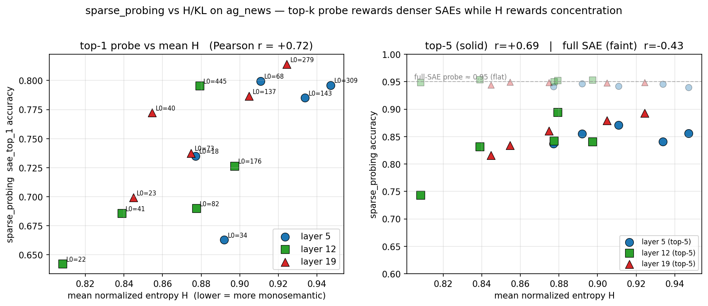

# SAE 特征单义性的信息论评估框架

本文档总结我们提出的基于香农熵 H 与 KL 散度的 SAE 特征单义性评估方法、相关实验结果以及与已有工作的对比。

---

## 1. 方法论：基于信息论的单义性度量 H 与 KL

### 1.1 动机

评估一个 SAE 特征是否"单义"，本质上是在问：**这个特征在激活的时候，是不是集中在某一个（或极少数）语义概念上？** 如果一个特征只在"电子邮件地址"这一类 token 上被点亮，那它就是高度单义的；如果它在"电子邮件"、"人名"、"城市"、"普通句法 token"上都会以不同程度被点亮，那它就是多义的。

要把这个直觉变成可计算的指标，自然的选择是把"特征的激活"视作一个在类别上的概率分布，然后用信息论的度量来刻画这个分布的形状：

- **分布集中在单一类别**：熵极低，接近 0；
- **分布均匀分散在所有类别**：熵极大，接近 $\log_2 C$。

在此基础上我们再引入 KL 散度作为辅助——它度量的是特征的类别分布相对于"数据本身的类别先验"的偏离程度，在类别分布严重不均衡的数据集上尤其重要（见 [1.6](#16-kl-散度作为辅助指标)）。

### 1.2 符号与记号

记号约定：

- $F$：SAE 特征总数（gemma-scope-2b-pt-res 16k width 下 $F = 16384$）；
- $C$：类别总数（pii-masking-300k 含非实体类时 $C = 26$，不含时 $C = 25$）；
- $N$：参与统计的有效 token 总数（`total_valid`）；
- $a_{f}(t) \ge 0$：SAE 特征 $f$ 在 token $t$ 上的激活值（JumpReLU 之后，严格非负）；
- $y(t) \in \{0, 1, \dots, C-1\} \cup \{-1\}$：token $t$ 的类别标签，$-1$ 表示被忽略的 PAD/特殊 token。

"特征在类别上的分布"的核心量是：

$$
S_f(c) = \sum_{t:\, y(t) = c} a_f(t), \qquad T_f = \sum_{c=0}^{C-1} S_f(c) = \sum_{t:\, y(t)\ge 0} a_f(t).
$$

$S_f(c)$ 是特征 $f$ 在类别 $c$ 所有 token 上的**累积激活强度**，$T_f$ 是它在所有有效 token 上的累积激活强度。对应代码见 [main_token.py:267-268](sae_bench/evals/info_theory/main_token.py#L267-L268) 的流式累加 `class_acts[c] += v_acts[cmask].sum(axis=0)`，以及 [main_token.py:332](sae_bench/evals/info_theory/main_token.py#L332) 的 `total_activation = class_acts.sum(axis=0)`。

### 1.3 条件概率 $P(c \mid f)$

给定特征 $f$，我们定义"在该特征被激活的条件下，token 属于类别 $c$ 的概率"为：

$$
P(c \mid f) = \frac{S_f(c)}{T_f}.
$$

注意两点：

1. **分母是激活强度之和而非 fire 次数**。这意味着 $P(c \mid f)$ 是一个**激活值加权**的分布，而不是"fire 过的 token 中各类占比"。在 JumpReLU SAE 下，强激活和弱激活对单义性判断的贡献不同——强激活更能代表"特征真正关心什么"，用激活值加权天然就给了强激活更大的权重。代码对应 [main_token.py:332-333](sae_bench/evals/info_theory/main_token.py#L332-L333)：

   ```python
   total_activation = class_acts.sum(axis=0)
   P = class_acts[:, alive_mask] / total_activation[alive_mask]
   ```

2. **只在 alive 特征上计算**。我们把 $T_f$ 极小的特征（`total_activation > 1e-5`，[main_token.py:323](sae_bench/evals/info_theory/main_token.py#L323)）视为死特征，排除在外；死特征的 $P(c \mid f)$ 会因分母过小而数值上不可靠，纳入统计只会引入噪声。

### 1.4 类别先验 $Q$

类别先验 $Q$ 取数据本身的 token 频次：

$$
Q(c) = \frac{N_c}{N}, \qquad N_c = \#\{t : y(t) = c\}.
$$

对应代码 [main_token.py:311](sae_bench/evals/info_theory/main_token.py#L311)：

```python
Q = class_token_counts.astype(np.float64) / class_token_counts.sum()
Q = np.clip(Q, 1e-10, 1.0)
```

我们**没有**采用均匀先验 $Q(c) = 1/C$，原因有两条：

1. **实际数据中的类别分布本身就是高度不均衡的**。以 pii-masking-300k 为例，"O"（非实体 token）占绝大多数，"GIVENNAME"、"CITY" 等常见实体有几千到几万 token，而 "PASSPORT"、"IDCARD" 等冷门类别只有几百。如果用均匀先验，KL 会被"凡是偏离均匀的分布"一概视为信息量高，把"只是跟着数据分布走"的平庸特征也奖励掉。
2. **token 频次先验让 KL 真正度量"相对于数据背景的偏离"**。一个特征如果其 $P(c \mid f)$ 恰好等于数据的类别频率 $Q(c)$，说明它对类别完全没有选择性——这正是我们希望 KL = 0 的情形。token 频次先验让这个直觉成立。

clip 到 $[10^{-10}, 1]$ 是为了避免 $\log(0)$ 的数值问题，不影响语义。

### 1.5 归一化香农熵 $H$

特征 $f$ 的（归一化）香农熵定义为：

$$
H(f) = \frac{-\sum_{c=0}^{C-1} P(c \mid f) \log_2 P(c \mid f)}{\log_2 C} \in [0, 1].
$$

代码见 [main_token.py:308, 335](sae_bench/evals/info_theory/main_token.py#L308)：

```python
log2_C = np.log2(num_classes)
...
h_alive = -np.sum(P * np.log2(P), axis=0) / log2_C
```

**归一化**（除以 $\log_2 C$）的作用是让 $H$ 总落在 $[0,1]$，从而可以跨类别数不同的数据集横向比较：

- $H(f) \to 0$：$P(c \mid f)$ 集中在某一类，特征**高度单义**；
- $H(f) \to 1$：$P(c \mid f)$ 均匀分散在所有类，特征**完全多义**；
- 中间值则量化了两端之间的连续谱。

**H 是本工作的主指标**。它直接刻画了"激活被多少个类别分享"这件事，且不依赖任何外部先验——只要特征的类别分布本身集中，H 就低。这正是单义性的朴素数学翻译。

### 1.6 KL 散度（作为辅助指标）

特征 $f$ 的 KL 散度定义为：

$$
\mathrm{KL}(f) = \sum_{c=0}^{C-1} P(c \mid f) \log_2 \frac{P(c \mid f)}{Q(c)}.
$$

对应代码 [main_token.py:336](sae_bench/evals/info_theory/main_token.py#L336)：

```python
kl_alive = np.sum(P * np.log2(P / Q[:, None]), axis=0)
```

**KL 和 H 关心的不是同一件事**：

- $H$ 关心"分布有多集中"；
- $\mathrm{KL}$ 关心"分布相对于数据背景偏离多少"。

两者在**类别分布高度不均衡**的数据集上会产生实质分歧。考虑一个极端例子：数据中 90% 的 token 属于"O"，只有 10% 是各种实体类。如果一个特征把 99% 的激活都打在"O"上，它的 H 仍然很低（集中在一个类），但它其实只是跟随数据背景、没有任何选择性。KL 会正确地把它判为低信息量（因为它的 $P$ 和 $Q$ 都集中在"O"）。

换句话说：

- **H 偏爱"集中"**，不管集中在哪；
- **KL 偏爱"与背景不同的集中"**。

在类别分布接近均衡时，$Q(c) \approx 1/C$，此时 $\mathrm{KL}(f) = \log_2 C - H(f) \cdot \log_2 C$，两者近似线性反相关，信息等价；在类别分布严重不均衡时，两者解耦，KL 能补上 H 忽略的维度。

因此我们的定位是：**H 作为主指标**承担单义性量化的主要工作；**KL 作为辅助指标**在类别先验严重不均衡的数据集上作为补救和交叉验证。后续 P/R 验证（第 3、4 节）中我们把 H 和 KL 作为两套独立的排序信号分别考察，正是为了让 H 的主角地位经得起对照。

### 1.7 为什么采用 token-level 设计

这套 H/KL 定义在 document-level 和 token-level 上都能形式化，区别只在于 $S_f(c)$ 的累加范围是 document 级还是 token 级。我们选择以 **token-level** 作为主战场，有两个原因：

**1）粒度决定信号强度**。我们最早是在 document-level 上做的（对应 [main.py](sae_bench/evals/info_theory/main.py)），在 ag_news（4 类）和 dbpedia14（14 类）这类粗粒度、类数少的数据集上，$H$ 普遍偏高——因为"一篇新闻"这种粒度天然会同时涉及多个概念，特征很难只在单一 document 类上激活。粒度太粗导致 $H$ 的动态范围被压缩、单义性信号被稀释。转到 token-level 之后，类别粒度从"文档主题"细化到"PII 实体类型"，类数也从十几个扩展到 25 个，$H$ 的分布才显著拉开、低 $H$ 特征才成规模地出现。这部分的对比数据将在 [第 2 节](#2-hkl-结果分析) 展开。

**2）细粒度标签本身更贴近"概念"的定义**。一个理想的单义特征应该和人类可识别的**最小语义单位**绑定，而"邮箱地址"、"人名姓"这种实体类型就是这样的最小单位。把它们作为 document 级主题的一部分（如"个人信息类新闻"）会丢失绝大多数结构。token-level NER 标签是天然的细粒度概念标注。

**方法论上的诚实观察**：即使转到 token-level，也很少有单个特征能独占一个 PII 类别——我们在实验中反复看到"一个 label 需要多个特征联合才能解释"的现象。这并不是方法论的缺陷，而是 SAE 特征本身的组合性：一个"人名姓"的概念可能分散在 3–5 个子特征上（大写字母开头 / 常见姓氏 / 西方人名 / ...），各自只覆盖一部分样本。这一观察直接促成了第 3、4 节 P/R 验证中采用 $k \in \{1, 5, 10, 20\}$ 的 joint union 评估——单特征 precision/recall 无法公平反映"top-k 特征联合覆盖"的真实情况。

### 1.8 有效特征筛选（alive mask）

上述所有公式只对 alive 特征计算，定义见 [main_token.py:323](sae_bench/evals/info_theory/main_token.py#L323)：

```python
total_activation = class_acts.sum(axis=0)  # [F]
alive_mask = total_activation > 1e-5
```

这是纯粹的数值稳健性考虑：$T_f$ 过小的特征会让 $P(c \mid f)$ 的分母接近 0，数值不可靠。被标记为非 alive 的特征在结果中记为 $H = \mathrm{KL} = -1$（[main_token.py:328-329](sae_bench/evals/info_theory/main_token.py#L328-L329)），在聚合统计时排除。

与此不同的是 **density band-pass 过滤**（`min_feature_density` / `max_feature_density`），那是对 alive 特征的进一步筛选，用于排除"句式/语法类通用特征"和"激活频次极低的噪声特征"——这属于**实验设置**而非方法定义本身，我们把它留到 [第 7 节](#7-实验设置) 统一说明。

---

## 2. H/KL 结果分析

本节基于 `eval_results/info_theory/gemma-2-2b/` 下三个数据集的实验结果，展示 H/KL 指标在不同数据集、不同层、不同稀疏度下的表现。所有数据均来自 15 个 `gemma-scope-2b-pt-res` SAE（3 层 × 5 L0），经过 density 过滤（`max_feature_density = 0.01`，详见第 7 节），每个 SAE 保留约 11k–15k 个特征进入统计。本节图表使用的数值与作图脚本见 [docs/figs/make_section2_figs.py](docs/figs/make_section2_figs.py)。

### 2.1 数据集粒度决定 H 的动态范围

H 的定义域是 $[0, 1]$，但它能不能把这整个区间用起来，取决于**任务类别的粒度**。我们在 ag_news (4 类, document-level)、dbpedia14 (14 类, document-level)、pii-masking-300k (25 类, token-level) 三个数据集上跑了同一组 15 个 SAE，聚合结果见表 2.1。

**表 2.1 三数据集聚合统计（15 SAE 平均，density-filtered）**

|   数据集    | 类别数 | 标签粒度  |  mean H    | median H   | mean KL    | frac(H<0.3) | frac(H<0.5) |
| :---------: | :----: | :-------: | :--------: | :--------: | :--------: | :---------: | :---------: |
|   ag_news   |   4    | document  |   0.8843   |   0.9748   |   0.2313   |    3.7%     |    7.3%     |
|  dbpedia14  |   14   | document  |   0.8451   |   0.9338   |   0.5908   |    4.2%     |    8.4%     |
| **pii_noO** | **25** | **token** | **0.4782** | **0.4996** | **2.4167** |  **23.5%**  |  **49.0%**  |

两个 document-level 数据集的 median H 都大于 0.93——超过一半的 alive 特征在这两个数据集上的类别分布**接近均匀**，"明显单义"（H<0.3）的特征占比只有 3.7% / 4.2%。**H 的动态范围被压缩在 [0.7, 1.0] 狭窄区间里**，绝大多数特征看起来都"差不多多义"，指标本身几乎失去分辨率。

切到 token-level 的 pii_noO 之后情况完全不同：mean H **砍半**到 0.48，median H 降到 0.50，明显单义特征的占比从 4% 跃升到 **23.5%**，呈现明确类别选择性（H<0.5）的特征占比接近一半。KL 的方向与 H 严格对称：mean KL 从 ag_news 的 0.23 上升到 pii_noO 的 2.42，约 10 倍放大。**H 和 KL 的动态范围只有在细粒度 token 级任务上才真正打开，方法本身才有信号可读**。

这不是 SAE 质量问题，而是"测量工具的分辨率必须匹配被测对象的结构粒度"。document 级任务只有 4–14 个粗类别，一篇新闻既是 world 又是 politics 又是 business，单个特征天然会同时落在多个主题上；把 label 细化到 token 级的 25 类 PII 实体之后，"一个特征只为一类实体激活"才成了数学上**可能**的事，单义性信号也才可能被 H 捕捉到。

**方法论推论**：后续分析的主战场是 pii_noO。ag_news 和 dbpedia14 的作用转为**对照**——它们帮我们分辨"哪些现象是 SAE 本身的，哪些是测量粒度决定的"。2.3 节中会用到这一对照。

### 2.2 在 pii_noO 上：L0 是单义性的主导因素

定好主战场后，回到 pii_noO，先把 L0 和 layer 两个因素的**边际贡献**分别隔离出来看。

**表 2.2a 按 layer 聚合（每层 5 个 L0 取均值，pii_noO）**

| layer  | mean H | mean KL |
| :----: | :----: | :-----: |
|   5    | 0.4738 | 2.5411  |
|   12   | 0.4759 | 2.3760  |
|   19   | 0.4850 | 2.3331  |

**表 2.2b 按 L0 档聚合（每档 3 层取均值，pii_noO）**

|         L0 档         | mean H | mean KL |
| :-------------------: | :----: | :-----: |
| ultra-sparse (L0<25)  | 0.3554 | 3.1038  |
|    sparse (25–50)     | 0.4239 | 2.7603  |
|     mid (50–100)      | 0.4889 | 2.3992  |
|    dense (100–200)    | 0.5482 | 2.0318  |
|  very-dense (>200)    | 0.5748 | 1.7885  |

两张表对比鲜明：

- **layer 的边际均值差别不到 3%**（H 从 0.474 漂移到 0.485）。单看平均，layer 对单义性的贡献接近可忽略——但这只是"边际均值"的故事，真正的 layer 效应在 2.3 节才会显现。
- **L0 的边际效应从 0.36 单调上升到 0.57**，相对增幅 60%；mean KL 对称地从 3.10 单调下降到 1.79。方向非常干净：**越稀疏的 SAE 特征越单义，越密的 SAE 特征越多义**。

L0 的方向与 SAE 训练的"稀疏—容量权衡"完全吻合。低 L0 意味着每个 token 只能激活极少数特征去完成对原始残差流的重构——重构预算被强约束之后，SAE 没有"余地"让一个特征去兼顾多个概念，**每一个被选中的特征都必须尽可能纯、尽可能精确地承担一个独立的语义方向**，才能在极低的激活预算下保住重构误差。反过来，高 L0 下每个 token 可以同时激活一两百个特征，同一概念可以被分摊、叠加、组合出来，单个特征没有"必须纯"的压力，自然就会学出更宽、更混合的激活模式。**稀疏性约束本身就是单义性的隐式损失函数**，我们的 H 指标只是把这一点从重构损失的副产物转化为可量化的信息论指标。

### 2.3 把 layer 放到"数据集 × L0"平面上：三种截然不同的 layer 结构

表 2.2a 的"layer 边际均值很平"只是 pii_noO 的平均效应，它掩盖了两件事：**(1) pii_noO 内部 layer 效应依赖 L0 档位、存在交互翻转；(2) 切到 document-level 数据集后 layer 效应变得非常稳定、layer 12 全程占优**。把 3 个数据集 × 3 个 layer × 5 个 L0 一次性铺在同一张图上，这两点就能同时显现：


从左到右是 ag_news / dbpedia14 / pii_noO，每个面板内三条线分别对应 layer 5（蓝, 浅）、layer 12（绿, 中）、layer 19（红, 深）。Y 轴（mean H）三面板对齐在 0.3–1.0，便于横向比较。

**(a) ag_news & dbpedia14：中层 layer 12 全程占优，三条线近乎平行下压**

在两个 document-level 数据集上，**layer 12 在所有 5 个 L0 档位上都是 H 最低的线**，layer 5 在所有档位上都是 H 最高的线，layer 19 稳定在两者之间偏低侧。三条线之间的间距从低 L0 到高 L0 大致保持不变——**layer 效应稳定、单调、不依赖稀疏度**。

语义解读很直接：新闻主题 / 百科类别这种概念的抽象度是"中等"的——比字符/词形局部高级，又比 next-token 预测任务导向低。**layer 12 正好是 gemma-2-2b 的"主题/话题/类别"表征带**，SAE 在这里最容易切出干净的单义方向。layer 5 的字符级、子词级特征和粗粒度主题系统错位，layer 19 开始向预测头倾斜、丢失可解释的中间抽象，两端都不如中层。这和"中层最语义化"这一类 representation probing 的普遍观察完全一致，也对应 Anthropic、Meta 等的 linear probing 报告。

**(b) pii_noO：三条线相互穿插，layer 效应随 L0 翻转**

同样的布局换到 pii_noO 面板上图景完全变了：低 L0 处 layer 19（红）最低、layer 5（蓝）最高；高 L0 处相对位置翻转，layer 5 反而降到最低、layer 19 升到最高；layer 12（绿）在任何档位都不占优。**layer 效应存在，但方向随 L0 翻转**——这正是 2.2a 边际均值看起来很平的内部原因：不同档位的 layer 排序被平均之后互相抵消。

语义解读：token-level PII 任务没有单一最优层，**PII 实体的识别线索横跨多个层次**：layer 5 能捕捉大写字母、数字格式、@符号这类正字法线索（邮箱、电话、ID 格式），layer 19 能捕捉句法角色和实体边界（人名、地点在句中的位置），layer 12 的主题级特征反而不是 PII 识别的主战场。于是就出现了交互翻转——极稀疏预算下，深层被迫把抽象的实体语义收紧到少数特征上（layer 19 占优）；宽松预算下，浅层的字符级线索更容易被单独绑定到某个实体格式上（layer 5 占优）。

**(c) 三种 layer 结构的总结**

|   数据集     | 标签粒度 |  概念抽象层级   |     layer 结构     |
| :----------: | :------: | :-------------: | :----------------: |
|   ag_news    | doc (4)  |   中等抽象主题   | layer 12 全程占优 |
|  dbpedia14   | doc (14) |   中等抽象主题   | layer 12 全程占优 |
|   pii_noO    | tok (25) | 多层次正字法+句法 | 低 L0 用深层、高 L0 用浅层，方向翻转 |

**"layer 最优在哪"这个问题，本质是"任务的概念粒度对应哪一层残差流"**。doc-level 主题有唯一最匹配的表征层（中层），于是 layer 效应是干净的；token-level PII 线索横跨多层，于是 layer 效应被 L0 预算调制、出现交互。

**跨数据集强结论**：三个面板的 Y 轴刻度对齐之后，可以读出一个震撼事实——**任何一个 pii_noO 的格子（哪怕 H 最高的那一格 0.628）都明显低于任何一个 ag_news / dbpedia14 的格子（哪怕 H 最低的那一格 dbpedia14 layer_12 L0=22, 0.760）**。数据集粒度对 H 的影响，比 layer × L0 所有组合加起来还要大。这给 2.1 节的核心结论升级了一个版本：不只是"粗粒度让 H 看起来偏高"，而是"**粗粒度下无论怎么调 SAE 的层和稀疏度，都达不到细粒度任务上一个随手挑的 SAE 的单义性水平**"。粒度是一阶效应、L0 是二阶、layer 是三阶。

**实践启示**：

- 目标是 **document-level 主题**类特征：首选 layer 12（中层）+ 任意 L0，L0 越低越好但边际收益递减。
- 目标是 **token-level 实体**类特征：L0 是主导变量（越低越单义），层次选择取决于 L0——极稀疏下优先深层（layer 19），高 L0 下优先浅层（layer 5）。
- 想要**跨任务通用**的单义特征池：优先低 L0，层次按下游任务的概念粒度挑。

### 2.4 按 SAE 逐个看：低 H 特征的绝对数量

聚合均值会平滑掉"哪些 SAE 真的产出了可用的单义特征"这个问题。表 2.4 给出 pii_noO 上每个 SAE 的低 H 特征计数：

**表 2.4 pii_noO：每个 SAE 在过滤后有多少低 H 特征**

| layer  |  L0 | # filtered | # H<0.1 | # H<0.3 | # H<0.5 |
| :----: | :-: | :--------: | :-----: | :-----: | :-----: |
|   5    |  18 |   12,187   |  2,162  |  4,297  |  7,658  |
|   5    |  34 |   13,734   |  1,615  |  3,643  |  7,206  |
|   5    |  68 |   14,071   |  1,229  |  3,339  |  7,075  |
|   5    | 143 |   13,612   |    883  |  2,786  |  6,041  |
|   5    | 309 |   12,190   |    544  |  1,956  |  5,038  |
|   12   |  22 |   11,512   |  2,428  |  4,873  |  8,294  |
|   12   |  41 |   13,371   |  1,722  |  4,008  |  7,896  |
|   12   |  82 |   14,347   |  1,024  |  2,752  |  6,430  |
|   12   | 176 |   13,558   |    597  |  1,912  |  5,018  |
|   12   | 445 |   11,110   |    622  |  2,031  |  4,630  |
|   19   |  23 |   12,264   |  2,647  |  5,268  |  8,872  |
|   19   |  40 |   14,064   |  1,916  |  4,473  |  8,645  |
|   19   |  73 |   15,045   |    851  |  2,865  |  6,939  |
|   19   | 137 |   14,638   |    207  |  1,293  |  4,452  |
|   19   | 279 |   12,645   |     41  |    525  |  2,323  |

**要点**：

- **最稀疏的 SAE 产出的单义特征数量碾压最密的**。以 H<0.1（几乎纯单义）为例，layer_19 L0=23 有 2647 个，而同层 L0=279 只有 41 个——相差 **65 倍**。即使放宽到 H<0.5，层内差距仍在 2–4 倍。
- **稀疏 SAE 的"低 H 特征绝对数量"依然不小**。L0<25 档的 SAE 每个都有 2000+ 个 H<0.1 的特征和 4000+ 个 H<0.3 的特征——这说明"单义性谱"的左端尾部足够厚实，下游使用时有充足的候选。

### 2.5 H 与 density 的联合结构

前两节的结论都建立在"按数据聚合看均值"的基础上，接下来我们跳到特征级别看 H 和 density 的联合分布：


每个点是一个特征，颜色按 layer 区分，横轴 density 取 log，纵轴是 H。散点揭示出一个清晰的**两段结构**：

- **低 density 区间 ($\sim 10^{-4}$ 到 $10^{-3}$)**：H 的分布呈现"上下两层"——上层贴近 1 的是多义特征，下层贴近 0 的是高度单义特征，两者并存。这正是"稀疏激活的特征可以非常单义也可以非常多义"的可视化证据。
- **高 density 区间 ($\sim 10^{-3}$ 到 $10^{-2}$)**：H 迅速向上收敛到 0.7–1.0 区间，低 H 特征几乎完全消失。也就是说——**只要一个特征激活得足够频繁，它几乎必然多义**。

这个结构给了第 7 节 density 过滤一个直接的数据依据：如果我们后续要用 H 低的特征做下游验证（第 3、4 节 P/R），那些 density 接近 $10^{-2}$ 上限的"高频通用特征"根本不在候选池里，提前把它们过滤掉既不损失信号、又能压缩计算量。换句话说，H 和 density 不是独立的两个指标，它们在特征空间上高度相关——**单义性基本等价于稀疏 + 定向**。

### 2.6 一个关键陷阱：为什么不能直接在 pii_withO 上读 H

还有一个必须交代的现象。如果我们**不排除** "O"（非实体）这一类，把 withO 结果作为单义性证据报告，会得到看起来极其亮眼的数字：

**表 2.6 pii_withO vs pii_noO 的对比陷阱**

|   数据集     | 类别数 |  mean H | median H | mean KL | frac(H<0.3) | frac(H<0.5) |
| :----------: | :----: | :-----: | :------: | :-----: | :---------: | :---------: |
|   pii_noO    |   25   | 0.4782  |  0.4996  | 2.4167  |    0.235    |    0.490    |
|  pii_withO   |   26   | 0.1962  |  0.1087  | 0.8205  |    0.743    |    0.892    |

withO 上的 mean H 从 0.48 暴跌到 0.20，median H 从 0.50 降到 0.11，"H<0.3 特征占比"更是从 24% 飙到 74%。如果只看 H，**结论会是"gemma-scope-2b-pt-res 的 SAE 有四分之三的特征是单义的"**——这显然不是事实。

陷阱的来源就是第 1 节预警过的：**"O" 占据绝对多数 token（80%+），一个只是跟随数据背景激活的平庸特征，其 $P(c \mid f)$ 会整个集中在 "O" 这一类上，从而获得非常低的 H**。H 量化的是"分布有多集中"，它无法区分"集中在有意义的实体类"和"集中在平庸的背景类"。

**KL 恰好在这里救场**。注意 pii_withO 上 mean KL 从 2.42 塌到 0.82——不到 noO 的 1/3。这说明那些 withO 上看起来"低 H"的特征，其分布和数据先验 Q 非常接近，偏离量很小，KL 如实地把它们判为低信息量。一个正常的单义特征应该同时具备**低 H 和高 KL**；只有低 H 而 KL 也低的特征，是在跟随背景、不是在表达概念。

这正是第 1 节所说 "H 为主、KL 为辅"中**辅助**的意义：当类别先验严重不均衡时，KL 是 H 的必要交叉验证。实践上，我们选择**直接把"O"类排除在评估之外**（pii_noO），让 H 在一个没有主导背景类的均衡场上做主判断，KL 的辅助作用留给跨数据集交叉检验。

### 2.7 小结与批判性观察

正面结论：

- 在足够细粒度的 token 级任务（pii_noO, 25 类）上，H 指标的动态范围完全打开，mean H ≈ 0.48，有 23.5% 的特征是明显单义（H<0.3），证明 gemma-scope-2b-pt-res 这一家 SAE 确实学到了可解释的单义特征。
- L0 是决定单义性的主导超参数：**越稀疏越单义**，方向与"稀疏约束迫使特征纯化"的训练直觉完全一致。
- layer 效应不是独立的，而是由"任务概念粒度对应哪一层表征带"决定：doc-level 主题任务上 layer 12 全程占优；token-level PII 任务上 layer 效应被 L0 调制，出现交互翻转。
- H 和 density 在特征空间上高度相关：高频特征几乎必然多义，低频特征两端分化（既有极单义也有极多义）。

批判性观察：

- **document-level 上这套方法分辨率不够**（ag_news/dbpedia14 上 median H 均 >0.93）——这不是 SAE 不好，是任务粒度和评估指标不匹配。任何想用 ag_news 这类粗粒度数据集评估单义性的工作都会低估 SAE 的质量。
- **layer × L0 的交互效应缺乏机制解释**。pii_noO 上高 L0 下浅层反超深层的现象，目前只能从"深层抽象语义"和"浅层正字法线索"两个角度给出定性猜测，没有直接的因果证据。
- **withO 陷阱是一个实打实的隐患**。任何基于"激活集中度"的单义性度量都有这个问题，不只是 H。这是一个值得后续工作注意的方法论坑——我们通过排除主导类 + KL 交叉验证来规避，但更优雅的解决方案（例如类别加权熵）留给未来工作。
- **alive 比例在极稀疏 SAE 上较低**（L0<25 时仅 ~72–77% 的特征 alive），意味着 SAE 的"可用容量"被稀疏约束打了折扣。这和 2.4 节"稀疏 SAE 单义特征数量依然可观"的结论不冲突——死特征本来就不在我们的候选池里。

---

## 3. P/R 方法论：H/KL 的反向交叉验证

### 3.1 为什么需要 P/R —— 核心 validation 论点

第 1、2 节用 $H(P(c \mid f))$ 和 $\mathrm{KL}(P(c \mid f) \parallel Q(c))$ 衡量了一个特征的类分布有多集中、多偏离数据先验。**但是这两个指标都沿着同一个方向计算：Feature → Concept**——给定一个激活事件，问"这个事件更可能属于哪一个类"。一个危险是，如果我们再用同样的 Feature→Concept 信号去评估"特征对一个类的忠实度"，就会陷入循环论证：被 KL 排序挑出来的特征，当然在"KL 想度量的指标"上分数高。

要打破这个循环，必须换一个正交方向：**Concept → Feature**——给定一个类的所有 token，问"我挑出来的 top-k 特征能覆盖这些 token 中的多少"。这正是 **Recall** 的定义，而它与 $P(c \mid f)$ 无关（参见 [verify_topk_features.py:21-23](sae_bench/evals/info_theory/verify_topk_features.py#L21-L23)）。Recall 在这里不是一个辅助指标，而是**整套 H/KL 框架在外部测度下的唯一非循环 validation**：如果按低 H / 高 KL 排出来的"单义特征"确实对应某个语义类，那么在那个类的全部 token 上，它们应该高频激活；反之亦然。

Precision 与 Recall 构成互补：Recall 检查"覆盖率"（我选出的特征是否抓到了这个类的大部分实例），Precision 检查"专一度"（当这些特征激活时，是不是真的只在这个类上激活）。一个理想的单义特征应当同时具备高 Recall 和高 Precision；而一个假单义特征（低 H 但只是因为恰好偶尔命中某个小类）会在 Recall 上露馅。

### 3.2 公式定义与原理

设特征集合为 $\mathcal{F}$，类空间为 $\mathcal{C}$。对每个特征 $f$，我们先用第 1 节已有的 $P(c \mid f)$ 把它**唯一地指派**给一个主类：

$$
c_f \;=\; \arg\max_{c \in \mathcal{C}} P(c \mid f)
\;=\; \arg\max_{c} \frac{\sum_{t:\, y_t = c} a_f(t)}{\sum_{t} a_f(t)}
$$

其中 $a_f(t)$ 是特征 $f$ 在 token $t$ 上的激活值，$y_t$ 是该 token 的类标签（[verify_topk_features.py:269](sae_bench/evals/info_theory/verify_topk_features.py#L269)）。**分子分母都是激活加权**，与第 1 节 $P(c \mid f)$ 的定义完全一致——这保证了"特征归属哪个类"这件事不是一个新引入的口径。一个特征只属于一个主类，避免它同时作为多个类的代表进入排序。

**Top-k 选取**。对于每个评估类 $c$ 和每个 ranking group $g$（分数函数 $s_g$），从主类为 $c$ 的候选特征集合中选前 $k$ 个：

$$
\mathcal{T}_{g,c,k} \;=\; \text{top-}k\bigl(\{f : c_f = c\},\; s_g\bigr)
$$

其中 $s_g$ 可以是 KL、H、density、$\text{density}\cdot\text{KL}$ 等（见 3.3 节表）。

**Token 级频率 P/R**。把 k 个特征当作一个 OR-union 分类器：一个 token $t$ 被预测为类 $c$ 当且仅当 $\mathcal{T}_{g,c,k}$ 中**至少有一个**特征在 $t$ 上激活。记指示函数 $\mathbb{1}_{\text{hit}}(t) = \mathbb{1}[\exists f \in \mathcal{T}_{g,c,k}: a_f(t) > 0]$，则：

$$
\text{TP}(c) = \sum_t \mathbb{1}_{\text{hit}}(t)\,\mathbb{1}[y_t = c],\quad
\text{FP}(c) = \sum_t \mathbb{1}_{\text{hit}}(t)\,\mathbb{1}[y_t \ne c],\quad
\text{FN}(c) = N_c - \text{TP}(c)
$$

$$
P_{\text{tok}}(g,c,k) = \frac{\text{TP}(c)}{\text{TP}(c)+\text{FP}(c)},\quad
R_{\text{tok}}(g,c,k) = \frac{\text{TP}(c)}{\text{TP}(c)+\text{FN}(c)}
$$

([L500-502](sae_bench/evals/info_theory/verify_topk_features.py#L500-L502))。OR-union 的原理是：我们想检验的是"这 k 个特征作为整体能否承担'类 c 的特征组'这一角色"——任一个发声就视为该组提供了证据。用 AND 或投票会引入额外的"集成规则"噪声，OR 是最接近"候选特征池"原意的聚合。

**幅度加权 Precision**。把激活值作为权重替代 $\mathbb{1}_{\text{hit}}$——记每个 token 上 k 个特征的激活之和 $w(t) = \sum_{f \in \mathcal{T}_{g,c,k}} a_f(t)$：

$$
P_{\text{amp}}(g,c,k) \;=\; \frac{\sum_t w(t)\,\mathbb{1}_{\text{hit}}(t)\,\mathbb{1}[y_t = c]}{\sum_t w(t)\,\mathbb{1}_{\text{hit}}(t)}
$$

([L504-506](sae_bench/evals/info_theory/verify_topk_features.py#L504-L506))。原理在 3.5 节详述：它把"强 TP 激活"和"弱 FP 激活"区分开，而 $P_{\text{tok}}$ 对两者一视同仁。

**Span 级 P/R**。把每段连续相同标签的 token 合并为一个 span 实例（索引为 $s$，类别为 $y_s$），一个 span 被 hit 当且仅当它包含的任一 token 被 OR-union 分类器激活：

$$
\text{TP}_{\text{spn}}(c) = \sum_s \mathbb{1}[y_s = c]\,\mathbb{1}\bigl[\exists t \in s: \mathbb{1}_{\text{hit}}(t)=1\bigr]
$$

FN 的分母换成类 $c$ 的 span 总数 $N^{\text{spn}}_c$ 而非 token 数 $N_c$。原理与动机在 3.4 节详述。

**Macro 聚合**。对每个 group/k 在类维度做 macro 平均，**仅对"该组在此类上至少产出 1 个特征"的类求平均**（[L665](sae_bench/evals/info_theory/verify_topk_features.py#L665)）。这避免了"严格组在罕见类上没出特征"被错误地记成 0 分而被惩罚——具体讨论见 3.7 节。

### 3.3 六个对照组：过滤语义

我们评估 6 个 ranking 组（代码中有第 7 个 `kl_fh` 作为历史组合组，但本总结**不讨论**它，因为它只是 `kl_f` + H 天花板的简单组合，单义性层面的对照已经由 `h_f` 和 `kl_f` 覆盖）。所有组的过滤/排序由 [`_score_feature_for_groups`](sae_bench/evals/info_theory/verify_topk_features.py#L200-L227) 统一决定：

| 组 | 排序分数 | 密度下限 | 含义 |
|---|---|---|---|
| `kl` | KL ↓ | 无 | 裸 KL 排名——只看分布偏离先验 |
| `h` | H ↑ | 无 | 裸 H 排名——只看分布集中度 |
| `density` | density ↓ | 无 | 频率排名——作为"高频特征是否就是好特征"的反例 |
| `mi` | density × KL ↓ | 无 | 互信息排名——频率 × 偏离度的权衡 |
| `kl_f` | KL ↓ | ✓ | KL 排名 + 剔除极低频噪声（`min_density`, 默认 0.001） |
| `h_f` | H ↑ | ✓ | H 排名 + 同样的低频底线 |

关键点：
- `density` 和 `mi` 是"检验指标能不能挑出真正单义特征"的反面基线。如果"所有高频特征都好"，那 density 就会碾压 KL——这种情况没发生（第 4 节会展示）。
- `kl_f` 和 `h_f` 的密度下限 `min_density` 只是为了防止"在 10000 条样本里只激活过 1~2 次"的罕见特征意外进入 top-k（这种特征 P/R 都无意义，既不能证伪也不能证实）。这是一个**噪声地板**，不是方法论的核心约束。
- `kl` 和 `h` 在没有任何下限的情况下和 `kl_f`、`h_f` 对照，可以独立测出"低频噪声地板"到底有没有影响——第 4 节会看到这两对的差异非常小，说明噪声地板是保守但几乎不改变结论的一个保险杠。

> **注：密度口径的分层关系**。P/R 阶段候选池已经限定 `density <= 0.01`（和第 1 节 H/KL 一致），`min_density=0.001` 只是在此之上再过滤极稀有特征，形成 `[0.001, 0.01]` 的窄带候选。不加 floor 的裸 `kl`/`h`/`density`/`mi` 则使用 `[0, 0.01]` 的完整候选区间。

### 3.4 Token 级 vs Span 级 P/R

对于文档级任务（ag_news / dbpedia14），一篇文章的所有 token 共享同一个类标签，"token 级"和"span 级"退化成同一回事。**span 级评估是为 PII 任务设计的**：PII 中一个实体（比如一个人名）往往由连续多个 token 组成，tokenizer 切得越细，一个实体就跨越越多的 token。

- **设计动机**：如果只看 token 级 Recall，一个特征即使稳定地命中"每个 PII 实体的首 token"，也会被判成低 Recall——它漏了后续 token。但从"实体发现"的角度，这个特征实际上已经 100% 成功了：每个实例都找到了。
- **Span 级的合理性**：PII 抽取的下游目标天然就是 **span 级**的——我们关心"有没有发现这个 PII 实例"，而不是"这个实例里的每个子词是否都被激活"。用 span 级 Recall 作为 PII 任务的主 Recall 指标，和实际使用场景对齐。
- **实现**（[L100-142](sae_bench/evals/info_theory/verify_topk_features.py#L100-L142)）：`_build_span_info` 把连续相同标签的 token 合并成 span 实例；评估时一个 span 只要**有任一个 token 被 top-k 特征集合激活**就算 hit（[L508-514](sae_bench/evals/info_theory/verify_topk_features.py#L508-L514)）。FN 数用 `class_span_count - span_tp` 而不是 token_count，保证 span 级 Recall 的分母是 span 数。
- **Span 级 Precision 的意义**：如果一个特征频繁在非目标类的 span 上激活，span-P 会下降。它比 token-P 更严格，因为非目标 span 只要被"沾边"一次就记一次 FP，不会被"同一 span 的多个 token 被一次 FP 稀释"。

### 3.5 频率精度 vs 幅度精度

同一个 top-k 特征集合有两种 Precision 口径（[L20-29](sae_bench/evals/info_theory/verify_topk_features.py#L20-L29)）：

- **频率精度**（frequency precision）：在所有"特征集合激活的 token"中，有多少属于目标类——这是一个计数量。
- **幅度精度**（amplitude precision）：把每个激活事件按该 token 上 top-k 特征激活值之和加权，再计算 weighted TP / (weighted TP + weighted FP)（[L504-506](sae_bench/evals/info_theory/verify_topk_features.py#L504-L506)）。

代码注释里提醒过幅度精度"不独立于 KL"（因为激活值本身进入了 $P(c \mid f)$ 和 KL 的计算）。但就**单义性诊断**而言，我们把幅度精度作为主要的精度指标，原因是它揭示了一个频率精度看不见的关键结构：

> **"FP 激活的幅度系统性地弱于 TP 激活"**

如果一个特征本质上是"为类 c 学习到的"单义特征，那么即使它偶尔在别的类上激活（频率 FP），那些激活值也会明显小于它在 c 上的典型激活值——因为网络其实只把这些弱激活当作 residual 噪声。频率精度把"弱 FP"和"强 TP"一视同仁，相当于丢掉了幅度信息；而幅度精度直接度量"总激活预算有多少真正花在了目标类上"，更贴近"这个特征作为类 c 的编码器到底有多纯"。

第 4 节将看到：在很多组合下，`frequency_P ≈ 0.5` 而 `amplitude_P ≈ 0.85`，这个差距本身就是"SAE 特征虽然事件上有 FP，但幅度上几乎都集中在目标类"的直接证据——单纯看 frequency_P 会严重低估 SAE 的单义性。

**循环论证的边界**：幅度精度只使用了"某个特征在某类 token 上的激活总量 vs 全局激活总量"，这和 $P(c \mid f)$ 的构造确实共享同一份原始信号。但 Recall（无论是 frequency 还是 amplitude 口径）仍然是严格非循环的外部验证——因此我们的主判断顺序是 **Recall 先行、amplitude Precision 辅助解释**，frequency Precision 作为保守下界。

### 3.6 k 阶 OR-union 与 random baseline

对每个 k 值，组内的 k 个特征以 **OR 并集** 的方式被视为一个整体分类器：一个 token 被这 k 个特征中的**任一个**激活就算该 class 的一次正预测（[L500-502](sae_bench/evals/info_theory/verify_topk_features.py#L500-L502)）。

- 这模拟了"我为类 c 分配 k 个专家特征"的 downstream 用法：只要任何一个专家发声就视为该类的证据。
- k=1 是最严苛的单特征视图，用于诊断"最纯净的单义特征有多强"。
- k=20 是"放宽单义性要求，用小型集成换覆盖率"的视图，用于诊断"SAE 的冗余结构"。
- 不同 k 之间的 Recall 爬升速度揭示了 SAE 对同一概念的多特征分布结构——一个概念是被 1 个特征独占，还是被 10 个子特征分摊。

**Random baseline**（[L419-428](sae_bench/evals/info_theory/verify_topk_features.py#L419-L428)）：对每个类 c 和每个 k，从该类的**全部候选特征**（即所有 argmax 分到 c 的、通过 density 过滤的 alive 特征）中均匀采 k 个，做 n_random_trials=10 次，取均值。这个 baseline 的意义是**排除"该类本来就容易被随便命中"的可能性**——它控制了候选池大小和类 token 频率。如果一个 ranking 组的 Recall 和 random baseline 差不多，说明排序本身没有提供信号。

### 3.7 Macro 聚合的"仅评估存在候选"规则

Macro 平均是在**类**维度上做的（[L653-712](sae_bench/evals/info_theory/verify_topk_features.py#L653-L712)）。一个关键设计：**一个类只有在当前组产出了至少 1 个特征时才进入该组的 macro 分母**（[L665](sae_bench/evals/info_theory/verify_topk_features.py#L665)）。

这不是一个小细节。如果一个过滤较严的组在 3 个罕见类上一个特征都没选出来，它不应该在这 3 个类上被记成 0 分——因为它**根本没做预测**。这种惩罚会让"严格组"被错误地判为更差。我们采取的策略是让每组在**它实际评估过的类**上取平均，并另外在输出中保留 `n_classes_evaluated_{g}` 字段，供第 4 节交叉检验"组的可比性"。

运行日志末尾的辅助输出（`n_classes_evaluated_kl_fh` 行）正是这个字段的打印——例子中 max_h=0.5 时 kl_fh=23.7/24，说明平均每次运行有约 0.3 个类被 H 过滤完全排空，其他指标都评估了全部 24 类（25 类减去 dropped CARDISSUER）。这给我们一个事后检验的锚点：macro 数字的可比性没有被"空类惩罚"污染。

---

## 4. P/R 结果分析

**本节的核心论证**：通过 P/R 的外部（非循环）测度，我们要回答一个直接的问题——**我们提出的 H/KL 指标对评估 SAE 特征的单义性，是不是有效的？** 本节的数据给出明确的正面答案，证据链由以下四步组成：

1. **非退化**（§4.2）：在密度地板加持下，H/KL 排序出的 top-k 特征**真的在目标类上稳定激活**，Recall 远离零——排除了"H/KL 只选到了永远不发声的极稀疏退化特征"这一可能。
2. **非随机**（§4.6 random 对照）：h_f 的 spnR 相对于 random baseline 高出 30–40 个点，证明 H 排名本身是一个**有效的单义性探测器**——而不是"候选池里随便挑都能拿到这样的 recall"。
3. **非高频**（§4.6 density/mi 对照）：density/mi 在 spnR 上能达到 0.97+，但 ampP 只有 0.30/0.41；h_f 的 ampP 达到 0.77——这证伪了"H/KL 只是间接挑了高频特征"的替代假设，H 排名挑出的是**真正分布集中的特征**。
4. **与稀疏性耦合**（§4.7）：P/R 独立重现了第 2 节的"L0 越低 → 越单义"趋势——ampP 从 tier0 的 0.82 单调降到 tier4 的 0.71——说明 P/R 口径下看到的"单义性"和 H 口径下看到的"单义性"指向同一个底层量。

把这四点合起来：**H/KL 在密度地板配合下挑出的 top-k 特征，在一个与 P(c|f) 正交的外部任务（Concept→Feature Recall）上显著优于随机基线和高频基线；这一优势在 ampP 口径下同样成立；并且与 SAE 稀疏性呈单调一致关系**。因此 H/KL 作为单义性指标的有效性得到了跨循环的外部验证——这正是第 3.1 节提出的 validation 目标。

---

本节所有数字是 **15 个 SAE**（3 层 × 5 L0）在 pii_noO（24 个评估类，CARDISSUER 已剔除）上的 macro 平均。结果目录：[eval_results/topk_pr_verification_v9_amp/](eval_results/topk_pr_verification_v9_amp/)。每行展示一种度量，每列展示一个 ranking group（外加 random baseline）。本工作最终用于 SAE 对比的主判断 (P, R) 对是 **(ampP, spnR)**——理由见 §4.4 与 §4.5。

### 4.1 核心结果表

列顺序：无地板组（`h` / `kl`）→ 有地板组（`h_f` / `kl_f`，即本工作主推）→ 高频基线（`mi` / `density`）→ `random`。
每个 k 组三行，把 P/R 两列合并成一格展示：**token 级 (tokP / tokR)** → **span 级 (spnP / spnR)** → **主判断对 (ampP / spnR)**——最后一组是本工作用于 SAE 对比的核心指标。单元格格式为 `P / R`。

```
 k | metric      |       h       |      kl       |      h_f      |     kl_f      |       mi      |    density    |    random
───┼─────────────┼───────────────┼───────────────┼───────────────┼───────────────┼───────────────┼───────────────┼───────────────
 1 | tokP / tokR | 0.978 / 0.013 | 0.802 / 0.015 | 0.821 / 0.168 | 0.807 / 0.159 | 0.312 / 0.687 | 0.179 / 0.630 | 0.419 / 0.043
 1 | spnP / spnR | 0.974 / 0.026 | 0.798 / 0.028 | 0.785 / 0.404 | 0.771 / 0.386 | 0.228 / 0.887 | 0.133 / 0.830 | 0.402 / 0.105
 1 | ampP / spnR | 0.985 / 0.026 | 0.812 / 0.028 | 0.858 / 0.404 | 0.836 / 0.386 | 0.438 / 0.887 | 0.251 / 0.830 | 0.448 / 0.105
───┼─────────────┼───────────────┼───────────────┼───────────────┼───────────────┼───────────────┼───────────────┼───────────────
 5 | tokP / tokR | 0.942 / 0.073 | 0.823 / 0.070 | 0.632 / 0.497 | 0.632 / 0.473 | 0.184 / 0.896 | 0.137 / 0.897 | 0.337 / 0.185
 5 | spnP / spnR | 0.926 / 0.110 | 0.807 / 0.109 | 0.517 / 0.799 | 0.514 / 0.782 | 0.117 / 0.974 | 0.089 / 0.973 | 0.296 / 0.391
 5 | ampP / spnR | 0.966 / 0.110 | 0.846 / 0.109 | 0.772 / 0.799 | 0.763 / 0.782 | 0.406 / 0.974 | 0.295 / 0.973 | 0.389 / 0.391
───┼─────────────┼───────────────┼───────────────┼───────────────┼───────────────┼───────────────┼───────────────┼───────────────
10 | tokP / tokR | 0.897 / 0.124 | 0.813 / 0.126 | 0.492 / 0.666 | 0.498 / 0.642 | 0.148 / 0.933 | 0.121 / 0.938 | 0.304 / 0.305
10 | spnP / spnR | 0.874 / 0.181 | 0.790 / 0.190 | 0.357 / 0.902 | 0.362 / 0.892 | 0.091 / 0.983 | 0.077 / 0.985 | 0.246 / 0.573
10 | ampP / spnR | 0.940 / 0.181 | 0.853 / 0.190 | 0.709 / 0.902 | 0.705 / 0.892 | 0.398 / 0.983 | 0.315 / 0.985 | 0.379 / 0.573
───┼─────────────┼───────────────┼───────────────┼───────────────┼───────────────┼───────────────┼───────────────┼───────────────
20 | tokP / tokR | 0.821 / 0.210 | 0.764 / 0.212 | 0.356 / 0.801 | 0.365 / 0.774 | 0.122 / 0.953 | 0.109 / 0.959 | 0.269 / 0.459
20 | spnP / spnR | 0.784 / 0.316 | 0.726 / 0.314 | 0.231 / 0.955 | 0.233 / 0.949 | 0.076 / 0.988 | 0.070 / 0.989 | 0.196 / 0.748
20 | ampP / spnR | 0.900 / 0.316 | 0.839 / 0.314 | 0.631 / 0.955 | 0.631 / 0.949 | 0.388 / 0.988 | 0.332 / 0.989 | 0.372 / 0.748
```

### 4.2 "密度地板"是必选项——裸 KL/H 的 recall 陷阱

**观察**：对比 `kl` 与 `kl_f`、`h` 与 `h_f`，Precision 几乎相等（k=1 时 kl 的 ampP=0.812 vs kl_f=0.836，差距 2.4 点），但 Recall 差 **十倍以上**：
- k=1：`kl` spnR = **0.028**，`kl_f` spnR = **0.386**（14 倍）
- k=1：`h` spnR = **0.026**，`h_f` spnR = **0.404**（15 倍）

**原理**：裸 KL/H 从整个候选池里挑出来的 top-1 是"那些只激活过 1-2 次但正好都落在同一个类"的特征——这种特征的 $P(c \mid f)$ 确实是 1（KL 和 H 都拿满分），但它们在整个测试集上几乎不发声。这是一个"Precision 完美却信号为零"的退化解。

**结论**：`min_density` 地板（默认 0.001）不是可选微调，而是让 KL/H 排名**真正产生覆盖率**的必要条件。第 3 节描述它为"噪声地板"有点保守——数据显示它同时在过滤掉一整个退化解的空间。第 4.2 节之后所有讨论都基于 `kl_f` / `h_f` / `density` / `mi` 这四个"有覆盖率的"组。

### 4.3 H-ranking 略优于 KL-ranking

**观察**：在所有 k 值上，`h_f` 的 Recall 都略高于 `kl_f`（k=5: 0.799 vs 0.782；k=10: 0.902 vs 0.892；k=20: 0.955 vs 0.949）。ampP 也相近但一致偏向 `h_f`。

**原理**：关键在于我们已经通过 $\arg\max_c P(c \mid f)$ 把特征分配给了目标类 $c_f$，**目标类已经固定**——此刻"谁更单义"就退化为一个单一问题：**$P(\cdot \mid f)$ 在类 $c_f$ 上有多集中**。H 直接度量这个集中度；而 KL 除了集中度之外，还会额外奖励"把剩余质量放在稀有类上"。

举例：同属类 $c_f$ 的两个特征
- 特征 A：$P(c_f \mid A) = 0.85$，剩余 0.15 均匀散到常见类——**更集中、更纯**
- 特征 B：$P(c_f \mid B) = 0.75$，剩余 0.25 集中在另一个稀有类 $c'$——**没那么集中**

按"为类 $c_f$ 挑一个代表特征"的目标，A 明显更优。H 排名也会选 A（H(A) < H(B)，因为 A 更 peaky）。但 KL 会被 B 在稀有类 $c'$ 上的 $\log(0.25/Q(c'))$ 这一项拉起来——只要 $Q(c')$ 足够小，这个对数就爆炸式增长，于是 KL 甚至可能把 B 排在 A 前面。

为什么 KL 会这样设计？因为 KL 的初衷是**判断一个特征是否有信号**：一个总是跟着数据背景走的平庸特征，其 $P(\cdot \mid f) \approx Q$，KL 近似为 0；一个把激活集中在任何一个稀有类上的特征都是"有话要说"的特征，KL 把它拉起来是合理的。这正是第 1 节用 KL 做跨数据集对比的原因——**在"有信号 / 无信号"这一全局二分问题上，能打中稀有类就应该被加分**。

但是在这里——类已经通过 argmax 固定了——这条逻辑反过来变成干扰：我们不再是在问"这个特征是否有信号"，而是在问"这个特征是不是类 $c_f$ 的好代表"，稀有类 $c'$ 上的质量与后者无关，KL 的加分只会把"有杂质"的特征误判成"更好"。H 没有这个缺陷，因为它只看 $P(\cdot \mid f)$ 本身的集中度，不和先验 Q 比较。

**结论**：后续讨论统一用 **`h_f` 作为默认参考组**。`h_f` 与 `kl_f` 之间的细微差距仅反映上述"分配到目标类后、类内再排序时，H 比 KL 更贴合目标"这一点；对本节主干结论（H/KL 框架 vs 高频基线）没有实质影响。两者都显著优于 density / mi。

### 4.4 amplitude Precision >> token Precision ——FP 激活的幅度系统性偏弱

**观察**：`h_f` 组在各 k 上的 tokP 与 ampP 对比：

| k | tokP | ampP | Δ |
|---:|---:|---:|---:|
| 1  | 0.821 | 0.858 | +0.037 |
| 5  | 0.632 | 0.772 | +0.140 |
| 10 | 0.492 | 0.709 | +0.217 |
| 20 | 0.356 | 0.631 | +0.275 |

k 越大，差距越大。k=20 时 tokP 只有 0.356（看起来"特征集乱放"）但 ampP 达到 0.631——这不是矛盾，而是直接对应第 3.5 节预言的**"FP 激活的幅度系统性偏弱于 TP 激活"**。

**原理与意义**：频率精度把每一次 FP 激活记作"1 票错分"，但 SAE 里那些 FP 激活的激活值往往只有 TP 激活的几分之一甚至十几分之一——网络其实把它们当噪声处理。用幅度精度，相当于按"这个特征的总激活预算"去分配功劳：即使 k=20 时特征集合在 FP 类 token 上多次零星发声，每次的激活都很小，真正构成"这个特征组语义贡献"的那部分激活仍然大部分（63%）落在目标类上。

**与 random baseline 对比**：k=20 时 `h_f` ampP=0.631 vs random ampP=0.372，差 **26 点**（而 k=20 tokP 只比 random 高约 9 点）。幅度精度把"SAE 比随机基线强在哪里"放大得更清晰：**不是 SAE 少犯错，而是 SAE 犯的错都是轻量级错**。

**结论**：amplitude Precision 是 SAE 单义性评估的正确精度口径——它避免了频率精度对弱 FP 的过度惩罚，同时保留了"区分目标类与非目标类"的判别意义。ampP 与 spnR 共同构成本工作对 SAE 的核心 (P, R) 度量对。

### 4.5 span Recall >> token Recall ——实体发现粒度与下游对齐

**观察**：k=5 上 `h_f` 的 tokR=0.497 vs spnR=0.799，差 **30 点**。k=10 上 tokR=0.666 vs spnR=0.902。

**原理**：多 token 实体（人名、地址、电话号码）在 tokenizer 切分后常常跨 3-8 个子词。span 级 Recall 把同一实例内的 token 折叠成一个评估单位：只要 k 个特征中任一个在该实例的任一 token 上激活，这个实例就算被发现。spnR 显著高于 tokR，说明我们挑出的特征**在每个 PII 实例上都有声音**，只是未必在实例的每个子词上都发声。从"能否识别出每个 PII 实例"这一**下游任务目标**看，span 级才是和 PII 抽取实际需求对齐的评估粒度。

**tokR 并非 spnR 的"下限版"**：spnR 与 tokR 之间的差距本身也是一个有意义的诊断量，但它的物理含义比"特征漏了一些 token"更微妙。一个 span 内 token 级不被覆盖，至少有两种来源：

1. **有些 token 所在位置本来就是跨类"脏 token"**：比如一个 FIRSTNAME span 里夹着一个逗号或前置词，而这个 subword 在别的上下文里也经常出现在 EMAIL、LASTNAME 等其他类的 span 中。如果有一个特征偏偏在这类 subword 上激活，它的 $P(c \mid f)$ 会被摊到多个类上，H 就会很高——**会被我们的 H-地板滤掉，不会进入 top-k**。结果是 top-k 特征"正确地"回避了这些模糊 token，tokR 因此降低——但这是**单义性选择的正收益**，不是召回漏洞。
2. **某些 subword 即使只出现在本类 span 里，也没有被任何 top-k 特征激活**：这才是"特征真的漏了 token"的意义上的 Recall 缺口。

换言之：**tokR 严厉惩罚了"特征避开了模糊 token"这一本来是优点的行为**，而 spnR 不做这种惩罚。因此 tokR 更像是 spnR 再叠加一层"实体内部激活均匀度"的惩罚——它回答的不是"我们能不能发现这个 PII 实例"，而是"我们能不能对这个实例的每个 subword 都发声"。后者不是单义性任务本该承担的负担，也不是下游使用场景关心的量。

### 4.6 与 density / mi / random 的对照——排除"recall 来自高频"的替代假设

到 4.5 为止，我们已经在 `h_f` 上看到了"ampP ~0.77 / spnR ~0.80（k=5）"的好结果。但这里存在一个关键的替代假设需要堵住：

> **h_f 的高 recall 是不是仅仅因为它顺带也选到了高频特征？**

如果答案是"是"，那 H 排名就没有独立价值——换成任何偏爱高频特征的分数都能拿到同样的 recall。为排除这一点，我们把 `density`（纯频率）和 `mi`（密度 × KL，带频率偏置的 H/KL）放进对照组；同时 `random` 作为"候选池大小 + 类频率"的平均基线。

**关键对比（k=5）**：

| 组 | ampP | spnR | 解读 |
|---|---:|---:|---|
| `h_f` | **0.772** | 0.799 | 主方法 |
| `density` | 0.295 | 0.973 | 频率最大化——recall 无 ceiling，但 ampP 塌陷 |
| `mi` | 0.406 | 0.974 | 频率 × KL 也一样——recall 被频率拉满，ampP 崩 |
| `random` | 0.389 | 0.391 | 控制候选池分布的零假设 |

**要点 1：`h_f` vs `density`/`mi`——spnR 的本质不同**。`density`/`mi` 的 spnR 几乎满分（0.97+），但 ampP 只有 0.30/0.41——这是因为它们挑出的是"任何类上都激活"的通用高频特征，这种特征当然会覆盖所有 span（spnR 高），但它们根本不是"该类的表达特征"（ampP 低）。`h_f` 的 spnR=0.799 虽然数字上低于 density，但它的每一个点都是"单义特征确实在这个 span 上激活"换来的，与 ampP=0.77 同时成立。**也就是说，同一组特征同时兼顾"纯度"和"覆盖率"——这才是单义性评估想要的证据**。

**要点 2：`h_f` vs `random`——recall 不是白来的**。random baseline 从"argmax 分到类 c 的全部候选特征池"里均匀采样——它已经控制掉了"候选池大小"和"类 token 频率"这两个结构性偏差。k=5 时 h_f spnR=0.799 vs random spnR=0.391，**高出 40 点**；k=10 时 h_f=0.902 vs random=0.573，**高出 33 点**。若 H 排序不提供单义性信号、只是在候选池里乱挑，它应该和 random 相当。事实上 h_f 明显超越 random，说明 H 排名本身就是一个有效的"单义性探测器"。

**要点 3：`h_f` 的 ampP 优势无法用高频解释**。如果 h_f 的 recall 是"无意间选到高频特征"的副产物，那它的 ampP 应该接近 density 的 ampP——但 `h_f` 的 ampP (0.77) 是 `density` 的 ampP (0.30) 的 **2.6 倍**，也高于 `mi` (0.41) 近一倍。这直接证伪了"高频解释"：**h_f 的 recall 不是来自于频率，而是来自于单义性本身**。

**推论**：任何把"高频 ≈ 重要"当作 SAE 特征质量近似的方法（包括一些早期探针/特征归因工作）都会把 density 这种退化特征和真正的单义特征混在一起。H 作为排序指标的价值，本质上就是把频率信号从特征选取中剥离出来——剩下的就是"分布集中度"这一纯粹的单义性信号。

### 4.7 稀疏性与单义性——P/R 对第 2 节结论的交叉验证

第 2 节观察到"L0 越低 → H 越低（越单义）"。P/R 是否同步支持这一结论？我们按每层 L0 档位把 15 个 SAE 分成 tier 0（最稀疏）到 tier 4（最密），在 k=5 上用 `h_f` 聚合：

| L0 tier | h_f ampP | h_f spnR |
|:---:|:---:|:---:|
| 0 (稀疏) | **0.816** | 0.787 |
| 1 | 0.802 | 0.791 |
| 2 | 0.778 | 0.813 |
| 3 | 0.753 | 0.803 |
| 4 (密) | 0.710 | 0.802 |

**观察**：
- **ampP 单调下降**：从 tier 0 的 0.82 降到 tier 4 的 0.71，差 11 点。稀疏 SAE 挑出的 top-5 特征幅度纯度显著更高——这是单义性信号。
- **spnR 基本持平甚至略升**（tier 0: 0.787 → tier 4: 0.802）：**但这并不代表 L0 更高的 SAE 更单义**。spnR 的细微上升有一个结构性解释：密 SAE 的 alive 特征数量更多（第 2 节看到 L0=22 时 ~72% alive，而 L0=445 时 ~99% alive），同类候选池更大，k=5 的 top-k 就更容易"拼凑"出覆盖一个类大部分 span 的组合。换言之，密 SAE 是**用"多特征冗余"换来"OR-union 覆盖率"**，而不是每个特征变得更单义。
- **真正反映单义性的是 ampP**，因为 ampP 衡量的是"单个特征集合的总激活预算有多少真正花在目标类上"——它不受候选池大小影响。ampP 单调下降说明**密 SAE 里的单个特征确实更不纯**；而 spnR 持平只是"特征多、拼起来总能覆盖"的副作用。

**结论**：第 2 节的 H 曲线和第 4 节的 ampP 曲线方向一致——都证实**稀疏性约束本身就是单义性的隐式损失**。spnR 在密 L0 上的小幅反弹不是单义性增强，而是候选池扩大带来的 OR-union 便利；这也提醒我们在跨 L0 对比时 ampP 比 spnR 是更干净的单义性指标。

### 4.8 层效应：晚层特征更纯，中层特征更全

| layer | h_f ampP (k=10) | h_f spnR (k=10) |
|:---:|:---:|:---:|
| 5  | 0.688 | 0.889 |
| 12 | 0.699 | **0.919** |
| 19 | **0.741** | 0.897 |

这里两种指标指向的不是同一件事，需要分开解读：

**layer 19 在 ampP 上最高（0.741）——晚层特征纯度更高**。ampP 度量"选出的特征激活有多大比例落在目标类上"。layer 19 领先约 4 点意味着：在这一层抽到的单义 PII 特征一旦激活，其激活值更集中在正确的 PII 类 token 上，FP 激活的幅度更弱。直觉上这对应"晚层的表征已经把 PII 实体类别抽象出来了"——底层 subword 特征已经被整合为跨 token 的实体级概念。

**layer 12 在 spnR 上最高（0.919）——中层候选覆盖面更宽**。spnR 高不一定等于单义性更好（4.7 节已经讨论过这个区分）——它更多反映"为每个 PII 类能找到多少不同的高质量候选特征"。中层 residual stream 通常被认为是"信息最丰富、专用化程度最高"的层（早期层还没有足够的抽象，晚期层已经开始为下一个 token 预测做准备而压缩信息），所以每个 PII 类在 layer 12 上能找到的单义候选**数量**更多，OR-union top-10 的覆盖率随之更高。

**两者的差异是"每个特征有多纯" vs "每个类有多少纯特征"**：layer 19 单个特征更干净但候选数量少；layer 12 单个特征略杂但候选数量多。这种"精度 vs 冗余度"的层间分工和第 2 节 doc-level 任务上"layer 12 全程占优"的发现**不矛盾**——doc-level 任务是主题级的粗粒度判断，只需要"很多能代表这个主题的特征"，layer 12 的宽候选优势恰好贴合；而 pii_noO 是实体级的细粒度判断，纯度（ampP）比候选数量更关键，所以 layer 19 略胜一筹。

整体差距不大（ampP 差 5 点，spnR 差 3 点），说明 **PII 实体信息在整个 residual stream 的中段到后段都被稳定编码**，只是形式略有不同。

### 4.9 小结与批判性观察

**核心论证回顾**：P/R 是否验证了 H/KL 作为单义性指标的有效性？是的——以下四条证据共同构成 validation：

1. **非退化**：加上密度地板后，h_f 的 spnR 从 0.026 提升到 0.40（k=1）、0.80（k=5）、0.90（k=10）——H 排名挑出的特征确实在目标类上稳定激活，不是永远不发声的退化解。
2. **非随机**：h_f vs random baseline 在 spnR 上相差 30–40 个点（k=5 时 0.799 vs 0.391），在 ampP 上 k=20 时相差 26 点。H 排名本身提供了单义性信号——如果 H 不区分有单义性与没有，这两个数字应该相等。
3. **非高频**：density / mi 作为"如果高频 ≈ 好"的反面基线，ampP 只有 0.25–0.41；h_f 的 ampP 达到 0.63–0.86，是 density 的 2–3 倍。H 排名挑出的不是高频特征，而是真正分布集中的特征——这与第 2 节"H 本身几乎不依赖密度"的观察一致。
4. **与第 2 节耦合**：L0 越低 → ampP 越高的单调趋势（0.82 → 0.71）独立重现了第 2 节"越稀疏越单义"的结论。两个完全不同的口径（一个看 P(c|f) 的集中度，一个看 Concept→Feature 的覆盖率）指向同一个底层量，这正是 construct validity 的教科书定义。

**结论**：H/KL 作为 SAE 特征单义性评估指标是**有效的**——P/R 验证在非循环的外部测度下做出了独立确认，且在多个对照假设（随机、高频、低频退化）上都能区分出 H/KL 的正向优势。本工作的 (ampP, spnR) 主判断对可以被后续 SAE 家族对比工作直接沿用。

**其他实证发现**（与核心论证配套）：
- Amplitude Precision 揭示了 SAE 的一个结构性事实：**FP 激活的幅度系统性偏弱**。只看频率精度会严重低估 SAE 的单义性质量，差距在 k=20 时高达 27 点。
- Span-level 评估把 PII 实体发现率真实地呈现出来，与 token-level 之间 30+ 点的差距来自"跨类脏 token 被 H 地板正确过滤"的正收益，而不是单纯的"特征漏了"。
- 层效应呈现出"晚层特征更纯、中层特征更全"的对偶分工；跨层差距整体不大，说明 PII 信息在 residual stream 的中后段都被稳定编码。

**批判性观察**：
- **绝对数字上仍有天花板**：即便最优配置下 `h_f` ampP 最高也只到 0.86（k=1），相比"完美单义特征"的 1.0 还有可观差距。这可能来自 (a) PII 任务内部的类间相似性（如 FIRSTNAME/LASTNAME 本身就不容易区分），(b) gemma-scope 这一家 SAE 的固有上限。分解这两部分需要多 SAE 家族对比，本工作未涉及。
- **`kl_fh`（H 天花板组合）与 `kl_f` 在所有结果上几乎相同**（对比 `max_h=0.5/0.6/0.7` 敏感性表：随着 max_h 放宽，kl_fh 与 kl_f 完全重合）。这说明密度地板之上再套 H 天花板**并没有提供额外信号**——第 1 节已经用密度过滤掉了真正的低信息量特征，H 天花板只是冗余约束。这也是本总结把 kl_fh 留在代码里但不在正文讨论的原因。
- **k=1 与 k=5 之间的 recall 跳变**（h_f spnR: 0.404 → 0.799）表明大多数类有 2-4 个"同义子特征"，真正的"一类一特征"并不常见。这是 SAE 在宽字典下的冗余现象，与 Templeton et al. 2024 中观察到的 "feature splitting" 一致。
- **CARDISSUER 类被剔除**使得本评估只覆盖 24/25 类。被剔除类是否会显著改变 macro 数字仍是一个保留问题——若其行为与 PII 其他类类似，macro 偏差可以忽略；若它本身特别难，剔除它会让我们系统性地**高估** P/R。这是一个需要在第 7 节实验设置中标注的口径限制。

---

## 5. 与 sparse_probing 的对比

SAEBench 中与本工作最接近的已有指标是 **sparse_probing**——它也试图回答"SAE 特征对语义概念的暴露程度"这个问题，但采用了完全不同的方法论。本节的目的是把两者放在一起说清楚：**它们测的是 SAE 的两个不同侧面，结论是互补而非替代**，并用同一组 SAE 在 ag_news 上的实际数字做经验对比，证明这种互补性不是口头上的，而是可观测的。

### 5.1 sparse_probing 方法回顾

sparse_probing 对数据集中的每一个类别 $c$ 训练一个 one-vs-rest 的 logistic regression probe，probe 的输入是 SAE 的激活向量。为了评估"SAE 有没有把类别信号集中到少数几个 latent 上"，它的关键一步是 **top-k 选特征**：按照

$$
\text{score}_j = \bigl|\,\mu^{+}_j - \mu^{-}_j\,\bigr|
$$

（类别正样本与负样本在第 $j$ 维 SAE 激活上的均值差的绝对值）从大到小选出 $k$ 个特征，只用这 $k$ 维训 probe，测 accuracy。$k = 1, 2, 5, \ldots$ 分别给出"最多用 1/2/5 个特征能达到多高的分类准确率"。代码对应 [probe_training.py:92-108](sae_bench/evals/sparse_probing/probe_training.py#L92-L108) 的 `get_top_k_mean_diff_mask`、[probe_training.py:134-182](sae_bench/evals/sparse_probing/probe_training.py#L134-L182) 的 sklearn logistic probe。最终输出的是 `sae_top_1_test_accuracy` / `sae_top_5_test_accuracy` / `sae_test_accuracy`（最后一个用全部 SAE 维度）。

### 5.2 测量对象的本质差异

两个方法都在问"SAE 暴露了多少类别信息"，但切入的维度不一样：

|  | **sparse_probing** | **本工作 H/KL** |
|---|---|---|
| 测量对象 | SAE 的一个 **子集** | SAE 的**每一个**单特征 |
| 回答问题 | 是否**存在** $k$ 个特征线性组合起来能分类 $c$ | 每个特征是不是只对应某一个概念 |
| 方向 | concept → features（给定类别找有用特征） | feature → concept（给定特征测类别分布） |
| 是否需要训练 | 需要训 probe（logistic regression） | 闭式统计，无训练 |
| 是否单特征可解释 | 否，top-k 之后的特征仍可能各自多义 | 是，每个特征有 $P(c \mid f)$ 与 $H_f$ |
| 类别不均衡处理 | 正负重采样至平衡 | 显式 $Q(c)$ 作 KL 基线（见 1.6） |
| 扩展到 token-level | 需要把 token 任务改写成 one-vs-rest，口径需要特殊处理 | 原生支持（pii-masking 25 类直接跑） |

**一个具体例子**说明两者为什么会给出不同的答案：假设 SAE 为"邮箱地址"这个概念分配了 **10 个多义特征**，每个都是"邮箱 + 某种别的 token"的混合。sparse_probing 在 top-5 或 top-10 下会得到很高的 probe accuracy（信息是"可用"的）；但按 H 的标准，这 10 个特征每一个的 $P(c \mid f)$ 都是分散的，$H_f$ 偏高，h_f 排序下它们的 precision 会很低——H 会正确地说"没有一个单特征是邮箱的单义表示"。反向的例子同样存在：一个特征只在某一类 token 的 10% 上被激活，但每次激活时几乎只指向那一类——H 会高度奖励它，可 probe accuracy 未必提升，因为它对大多数样本沉默。

换句话说：
- **sparse_probing 测的是 "dictionary 是否信息充分"**（*sufficiency*）；
- **H/KL 测的是 "dictionary 是否解耦"**（*disentanglement*）。

这是两个正交的性质——下游的 circuit discovery、steering、attribution 同时需要这两者。

### 5.3 方法层面的互补

- **监督 vs 无监督**：sparse_probing 需要有标签的训练集做 probe，每到一个新数据集都要重训；H/KL 是纯统计量（$O(N \cdot F)$ 流式累加），只要 token 有标签就能算，天然适用于 pii-masking 这种 25 类的 token-level 任务。
- **Scalar vs feature-level**：sparse_probing 最终输出一个 dataset-level 的 accuracy，**不指向具体特征**——你知道"前 5 维够用"，但不知道每一维在说什么；H/KL 自带每个特征的 $c_f = \arg\max_c P(c \mid f)$ 与 $H_f$，可以直接拿来做 feature dashboard、下游 retrieval、steering 候选筛选。
- **类先验**：sparse_probing 的二分类设置本质上抹掉了类先验（正负采样做了平衡）；H/KL 通过 $Q(c)$ 显式把类先验放进指标，在 PII 这种重尾不均衡数据上是必要的。

### 5.4 经验对比：ag_news 上的正面交锋

**实验配置对齐**。为了让两套指标可以逐 SAE 点对点比较，我们把 sparse_probing 的运行配置与 info_theory 实验严格对齐：模型 `gemma-2-2b` (bfloat16)、`gemma-scope-2b-pt-res` 16k width、layer 5/12/19 共 **同样 15 个 SAE**、`context_length=128`（与 info_theory 一致，也正好是 sparse_probing 的默认值）。由于 sparse_probing 当前版本没有按数据集筛选的命令行开关，我们跑了它默认的全部 8 个数据集（包括 `fancyzhx/ag_news`），然后从结果 JSON 里提取 `fancyzhx/ag_news` 这一条与 info_theory 的 ag_news 结果对齐。结果落在 [eval_results/sparse_probing/](eval_results/sparse_probing/)，info_theory 对应结果在 [eval_results/info_theory/gemma-2-2b/ag_news_test_n10000_ctx128/](eval_results/info_theory/gemma-2-2b/ag_news_test_n10000_ctx128/)。

**逐 SAE 原始数据**（15 行，按 layer/L0 升序）：

```
layer | L0   | mean_KL | mean_H |  SAE_k=1 |  SAE_k=5
──────┼──────┼─────────┼────────┼──────────┼─────────
   5  |  18  |  0.246  | 0.877  |  0.735   |  0.837
   5  |  34  |  0.216  | 0.892  |  0.663   |  0.855
   5  |  68  |  0.178  | 0.911  |  0.800   |  0.871
   5  | 143  |  0.132  | 0.934  |  0.785   |  0.840
   5  | 309  |  0.106  | 0.947  |  0.796   |  0.856
  12  |  22  |  0.384  | 0.808  |  0.642   |  0.744
  12  |  41  |  0.322  | 0.839  |  0.686   |  0.832
  12  |  82  |  0.245  | 0.877  |  0.690   |  0.843
  12  | 176  |  0.205  | 0.897  |  0.727   |  0.841
  12  | 445  |  0.241  | 0.879  |  0.796   |  0.894
  19  |  23  |  0.310  | 0.845  |  0.699   |  0.816
  19  |  40  |  0.291  | 0.855  |  0.772   |  0.834
  19  |  73  |  0.251  | 0.875  |  0.738   |  0.861
  19  | 137  |  0.190  | 0.905  |  0.786   |  0.879
  19  | 279  |  0.151  | 0.924  |  0.814   |  0.893
```



**整体 Spearman 相关系数**（$n = 15$，全部 15 个 SAE 作为样本）：

```
对比                         rho       p-value   显著性
─────────────────────────────────────────────────────
mean_KL  vs  SAE_k=1        -0.718    0.003     **
mean_KL  vs  SAE_k=5        -0.657    0.008     **
mean_H   vs  SAE_k=1        +0.718    0.003     **
mean_H   vs  SAE_k=5        +0.657    0.008     **
```

（$H$ 与 KL 在符号上互为相反方向，两行各对应同一事实的两种写法。下面的解读统一以 **mean_KL vs SAE_k=1** 为主。）

**按层细分**的 Spearman（KL vs k=1，每层 $n = 5$）：

```
layer   rho     p-value   显著性
─────────────────────────────────
  5    -0.60   0.285      n.s.
 12    -0.90   0.037      *
 19    -0.90   0.037      *
```

### 5.5 应如何看待这对结果

数据给出了三个并列的事实，需要一起解读：

**(1) 绝对相关性强、统计显著、方向"反常"**。全部 15 个 SAE 上 $|\rho| \approx 0.72$、$p \approx 0.003$，远小于常用阈值。但**符号是反的**——KL 越高（越单义）对应 sparse_probing 的 top-k accuracy 越**低**。换成 $H$ 的写法就是：**SAE 在本工作的单义性口径下看起来越"差"（特征越分散），在 sparse_probing 口径上反而越"好"**。这不是噪声——Pearson 与 Spearman 给出完全相同的量级与符号，$p < 0.01$ 下方向可信。

**(2) 反常的来源是 L0 这一个共同混淆因子**。在每条 layer 色带内部（固定层），随 L0 增加，`SAE_k=1` 单调上升，`mean_H` 也单调上升、`mean_KL` 同步下降：
- 层 5：L0 18 → 309，top-1 0.735 → 0.796，mean_KL 0.246 → 0.106
- 层 19：L0 23 → 279，top-1 0.699 → 0.814，mean_KL 0.310 → 0.151

sparse_probing 的 top-k 选特征本质是一个"哪几个 latent 的 $\mu^+ - \mu^-$ 绝对值最大"的线性判别——**L0 越大的 SAE 有越多候选 latent 可以被线性组合起来覆盖一个类别**，因此 top-k accuracy 随 L0 单调上升；而同一组 SAE 里，L0 越大通常意味着单个特征越分散（H↑、KL↓）。两个指标沿着 L0 这一个旋钮滑动，方向相反，因此产生了 $|\rho| \approx 0.72$ 的反向单调。**这不代表两个指标矛盾，而恰好是"它们在测不同性质"的定量证据**：sparse_probing 奖励 *collective discriminability*（特征多、冗余、线性可分），H/KL 奖励 *individual disentanglement*（每个特征自己就是一个语义单元）。

**(3) 满维 probe accuracy 恒定 ≈ 0.95**（[fig_sparse_probing_vs_h.png](figs/fig_sparse_probing_vs_h.png) 右 panel 淡色点）。无论 L0 低还是高，只要把所有 SAE 维度都交给 probe，accuracy 总在 0.94-0.95 一条水平线上。这说明**SAE 的总信息量在所有 15 个配置下基本守恒**，区别只在"怎么把这些信息分配到 latent 上"。因此 ag_news 上 sparse_probing 的 top-k accuracy 更接近"SAE 的冗余度/稠密度"的测度，而不是"SAE 是否有 ag_news 能力"的测度——这个解读和第 2 节观察到的"doc-level 任务上 H 在 layer 12 有 sweet spot、对 L0 非单调"是自洽的。

**(4) 相关性在深层更强**。按层拆分后，layer 12 和 layer 19 的 `KL vs k=1` 都达到 $\rho \approx -0.90$（$p < 0.05$，近似完美单调反相关），而 layer 5 只有 $-0.60$（$p = 0.29$，不显著）。两个可能的解释：
- **深层特征信息量更大**：晚层已经汇聚了高层语义（第 2 节显示 layer 12 是 doc-level 任务上 H 最低的层），因此一旦 L0 被调大，top-k 线性可分性的提升空间也更大——sparse_probing 的 top-1 在深层能从 0.64 爬到 0.80，跨度是浅层的两倍多；浅层本来就没多少 ag_news 信号可挖，top-1 几乎不随 L0 动。
- **浅层语义更加碎片化**：layer 5 的特征多是 token/词法级别的，ag_news 类别信号是若干此类特征的非线性组合，top-k 的线性 probe 捕捉不到；H/KL 在浅层虽然读数仍然变化，但跟 probe 指标的对齐就弱了。

这两种解释都指向同一个方向：**深层是 sparse_probing 与 H/KL 能在相同数据上给出一致方向读数的"最佳对齐区间"**；浅层两种指标读到的东西更加不同。

### 5.6 小结

sparse_probing 和 H/KL 不是竞争关系，而是沿两个正交轴评估 SAE 的两个必要性质：
- **sparse_probing**：dictionary 对目标概念的**信息充分性 / 集体可判别性**（少数几维 latent 的线性组合能不能分类）；
- **H/KL**：dictionary 的**解耦程度 / 单特征可解释性**（每个特征是否独立承载单一语义）。

ag_news 上的经验对比给出了三个可以引用的具体结论：

1. **绝对相关性强 ($|\rho| \approx 0.72$, $p \approx 0.003$)**：说明 H/KL 与 sparse_probing 并非互不知情，它们共享一个可观测的 SAE 属性维度。
2. **符号反向**：强相关沿着 L0 旋钮反向滑动——sparse_probing 奖励冗余+稠密、H/KL 奖励集中+稀疏——这是"两个指标测不同性质"的定量证据，而不是矛盾。
3. **深层对齐最强（layer 12/19 $\rho = -0.90$, layer 5 $\rho = -0.60$）**：H/KL 与 sparse_probing 在晚层 SAE 上最对齐，正是这一区间最适合用 H/KL 做 sparse_probing 的**无标签替代**——不用训 probe 也能给出同方向的 SAE 排名。

一个同时要做 circuit discovery 和 steering 的工作流需要**同时**在这两维上达标：高 sparse_probing accuracy 确保"信号在 SAE 里"；h_f 排序下高 precision 确保"每个信号都绑在一个单独的特征上"。本工作填补后一个维度，提供一个**无监督、特征级、原生处理类别不均衡、可跑在 token-level 任务上**的单义性度量，作为 sparse_probing 的正交补充。

---

## 6. 与已有工作的关系

SAE 特征单义性评估不是一块空地——Anthropic、OpenAI 以及后续的可解释性社区已经发展出几条互不相同的技术路线。本节把这些工作按**方法论范式**分成四类，给出每一类的代表文献、核心原理、固有限制，然后在 6.5 节用一张表把本工作放进这张地图里。

### 6.1 人工 / 自动可解释性标注 (manual & auto-interp)

这条线的代表是 Bricken et al. 2023 "Towards Monosemanticity" 和 Templeton et al. 2024 "Scaling Monosemanticity"。基本流程是：把每个 SAE 特征的 top-k 激活样本拿出来人工检查或交给一个强 LLM，让它生成"这个特征在响应什么"的自然语言描述，然后再用另一个 LLM（或人）对这个描述打分，测它对该特征未来激活的 **specificity**（描述是否准确）与 **sensitivity**（描述是否完整）。OpenAI 的 Bills et al. 2023 "Language models can explain neurons in language models" 把这套流程自动化到 neuron 级别，后续的 auto-interp 工作（如 Paulo et al. 2024）把打分过程结构化为 detection / fuzzing 等可复现协议。

**优点**：输出的是自然语言，对人类最可读；能抓到本工作完全抓不到的现象（比如"这个特征响应任何含有数字的上下文"——这种模式在 class-label 口径下是不可见的）。

**限制**：
- **成本高**：每个特征至少一次 LLM forward 用于生成描述、若干次 forward 用于打分；在 16k × 15 SAE 的规模上，整套跑一遍需要可观的 LLM 预算。
- **依赖打分模型**：不同打分 LLM 给出的 specificity 分数方差可观，横比多家 SAE 时需要锁定同一个打分 backbone。
- **不指向 dictionary 全局统计**：通常只对 top-N（按某种密度/激活幅度）特征跑 auto-interp，剩下大多数"沉默"或"中等"特征没有评估。
- **任务相关性弱**：auto-interp 给出的描述未必与下游任务的语义单元对齐——一个特征被描述为 "responds to street names"，但你关心的是 "LOCATION vs ORG" 的区分时，这个描述的有用程度要看你怎么对齐。

**与 H/KL 的关系**：**互补**。auto-interp 回答 "这个特征在说什么"，H/KL 回答 "这个特征说得多干净"。两者可以串联：先用 H/KL 的 h_f 排序在 16k 个特征里挑出 top-N 候选（廉价），再对这 N 个跑昂贵的 auto-interp 生成描述。这种 pipeline 把 LLM 预算从 $O(F)$ 降到 $O(N)$，且保证进入 auto-interp 的都已经是在某个类别上 peaky 的特征。

### 6.2 Probing 类 (supervised probe)

代表：sparse_probing（SAEBench 内置，本工作第 5 节已正面对比）、Gurnee et al. 2023 "Finding Neurons in a Haystack"（neuron-level linear probe）、SAEBench 里的 SCR 与 TPP（基于 spurious correlation removal / targeted probe perturbation 的变体）。基本流程是：固定一个监督任务（通常是二分类或多分类），在 SAE 激活上训一个（稀疏）线性 probe，用 probe accuracy 作为"SAE 是否暴露了这个概念"的间接度量。

**优点**：客观、有标签约束、输出单个 scalar 便于横比 SAE；与下游任务可分性直接挂钩。

**限制**（本段只列第 5 节未深入讨论的点）：
- **间接**：probe accuracy 是"集合性质"，无法定位到具体的 latent；即使 top-1 probe 挑出了某个 feature idx，它也没告诉你这个 feature 是不是**只**响应该类。
- **类别二元化**：原生设计是二分类 one-vs-rest，扩展到 25 类 token-level 任务需要跑 25 次 probe，不如 H/KL 自然。
- **协变量混淆**：第 5 节已经展示——在 ag_news 上 probe accuracy 随 L0 单调上升、满维 probe 恒为 0.95，说明 probe 指标对"SAE 的冗余度"比对"SAE 的能力"更敏感。

**与 H/KL 的关系**：**正交**。第 5 节的 $|\rho| \approx 0.72$ 反向单调是这一点的定量证据。

### 6.3 因果 / 干预类 (causal intervention, steering, attribution)

代表：Templeton et al. 2024 里的 steering / ablation 实验、Marks et al. 2024 "Sparse Feature Circuits"、以及 attribution patching / activation patching 类方法。基本流程是：对某个候选特征 $f$ 做 clamp（把 $a_f$ 强制设为 0 或某个值）或替换，然后观察模型的输出分布或下游任务 accuracy 的变化。变化越大，越说明这个特征"因果地承担"了某个功能。

**优点**：这是唯一真正测 **因果** 而不仅仅是相关的方法；输出是行为层面的 delta，对下游应用（steering、模型编辑、safety intervention）最有直接意义。

**限制**：
- **代价高**：每个候选特征至少一次额外 forward；做 dictionary-wide 评估成本不可接受，实际上这类方法只对人工/自动挑出的**少数候选**跑。
- **候选选择本身是个问题**：干预法的 bottleneck 不是干预本身，而是"干预哪些特征"。如果候选挑错，所有后续实验白做。
- **行为 delta 与单义性不等价**：一个特征被 clamp 掉会让模型行为变差，不代表它"单义地代表"某个语义——它可能只是某个分布式表示里的一小部分，clamp 后模型退化是因为损失了一个冗余维度而非一个概念。

**与 H/KL 的关系**：**互补**。H/KL 的 h_f top-k 可以**直接用作干预实验的候选池**：在 16k 个特征里先按 h_f 排序挑出每个类别的 top-5 候选（每类 5 × C 个特征，共几十到几百个），再对这些候选跑干预实验。这比"按 density 挑"或"按 mean activation 挑"更贴近"单义"目标，且 H/KL 本身的计算代价可以忽略。

### 6.4 信息论 / 结构度量类 (information-theoretic & structural)

这是与本工作最接近的相邻邻域。几条子路线：

- **激活分布几何**：部分工作（如 Cunningham et al. 2023 "Sparse Autoencoders Find Highly Interpretable Features"）观察 SAE 特征的激活直方图形状、kurtosis 等统计量，间接判断"是否像一个 peaky detector"。这是"几何"路线，不直接使用外部标签。
- **Neuron-level class entropy**：Gurnee et al. 2023 及后续工作在 MLP neuron 层面计算过类似 "激活在类别上的分布集中度" 的量，但核心对象是 neuron 而非 SAE feature，且通常不做 density floor / $Q(c)$ 基线处理。
- **Feature monosemanticity score (FMS) 类指标**：近期有若干工作试图给出单一 scalar 的 "monosemanticity score"，但具体定义在论文之间差异较大——部分用 top-k 样本的类别纯度，部分用激活分布的熵与参考分布的比较。[TODO: 补充具体引用 —— Leask et al.? FMS 的 specific paper?]

**本工作相对于这条线的位置**：
1. **对象是 SAE feature 而非 neuron**，并且显式处理 SAE 特定的问题（极稀疏、长尾死特征、不同 L0 的可比性）。
2. **显式类先验 $Q(c)$** 作为 KL 基线，把"类别分布的信息量"与"类别不均衡"解耦（见 1.6 节）。在 PII 这种 25 类重尾数据上这一点是必要的。
3. **密度地板**是这类工作里少见但关键的一步——我们在第 4.2 节用 P/R 实验证明不加地板会产生 recall 坍塌。已有工作很少把这一工程细节当作指标定义的一部分。
4. **特征→类别的 argmax 分配 + 反向 P/R 验证**是本工作独有的：把 h_f 排序的指标放到外部非循环测度下做独立 validation，避免了信息论指标自说自话的循环问题（见第 3 节）。
5. [TODO: 确认 是否已有工作明确使用 class-conditional entropy 作为 SAE 特征评估指标；如果存在，需要正面引用并区分本工作与之的差异]

### 6.5 本工作在这张地图上的位置

用一张表对齐四类方法在几个关键维度上的表现：

| 维度 | auto-interp | probing | 干预 | **本工作 H/KL** |
|---|---|---|---|---|
| 无监督 | 部分（仍需 LLM） | ✗ | ✗ | ✓ |
| 特征级输出 | ✓ | ✗ | ✓ | ✓ |
| 单个 SAE 的计算代价 | 高（$O(F)$ LLM 调用） | 中（probe 训练） | 高（$O(\text{候选})$ forward） | 低（$O(N \cdot F)$ 流式） |
| 处理类别不均衡 | 无机制 | 需 resample | 无相关 | 原生（$Q(c)$ 基线） |
| 原生支持 token-level 多类 | 困难 | 改造后可 | 困难 | ✓ 原生 |
| 输出物 | 自然语言描述 | scalar accuracy | 行为 delta | 每特征 $P(c \mid f) / H_f$ |
| 反向 validation | 需要第二个 LLM 打分 | accuracy 即 self-validation | 行为 delta 即 ground truth | 第 3–4 节的 P/R 框架 |

### 6.6 本工作的 contribution 定位

综合上面四条线，本工作的 contribution 可以浓缩为三句话：

1. **对 auto-interp 是 pre-filter**：把 LLM 预算从 $O(F)$ 降到 $O(N)$，先用 h_f 在 16k 特征里排名挑出 top-N 单义候选，再跑昂贵的自然语言描述与打分。
2. **对 probing 是正交补充**（第 5 节已定量展示）：sparse_probing 测"信息够不够"，H/KL 测"信息是否解耦"；两者在同一组 SAE 上沿 L0 方向给出**反向**的读数，说明它们确实在测不同的性质。
3. **对干预法是候选池**：在干预实验开始之前，用 h_f top-k 作为每类的候选特征源，把"选干预目标"这一步从人工启发式改成一个无监督的、可复现的排序。

此外，本工作自身包含一个不依赖外部方法的 **self-validation 回路**：H/KL 指标（第 1 节）→ h_f 排序得到候选特征集合 → 在独立 P/R 测度下做反向验证（第 3–4 节）→ 发现 h_f 的 ampP、spnR 显著高于 density/mi/random 基线，且随 L0 单调变化。这个闭环是本工作相对于已有信息论类度量的一个方法论层面的独立贡献：**信息论 SAE 评估指标的有效性需要一个外部非循环测度来背书，本工作提供了这样的背书框架**。

---

